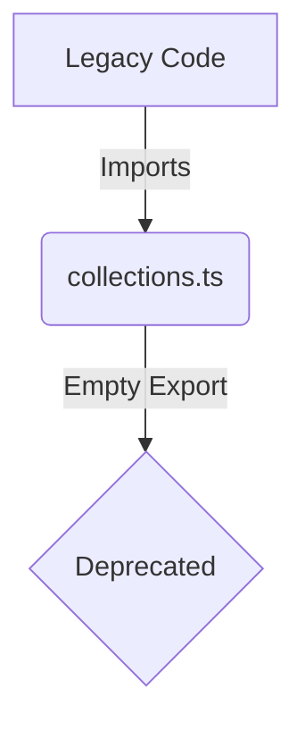

# Documentation: src/api/collections.ts

## 1. Overview & Role
This file previously defined Firestore collections for the application. However, as the application's data layer has been fully migrated to Supabase, this file is now deprecated and exists solely to prevent import errors in older parts of the codebase that haven't been cleaned up, or as a placeholder noting the migration.

## 2. Imports & Dependencies
There are no imports in this file.

## 3. Data Structures / Interfaces
None.

## 4. Deep-Dive: Methods & Functions
None. The file only contains an `export {}` statement.
- **Step-by-Step Logic**: `export {}` ensures the file is treated as a module by TypeScript, even without any actual exports.
- **Modification Guide**: If you are completely removing legacy code and verify no other files import from `collections.ts`, you can safely delete this file.

## 5. Code Examples
```typescript
// No code examples apply as this file contains no functional logic.
```

## 6. Data Flow Diagram

