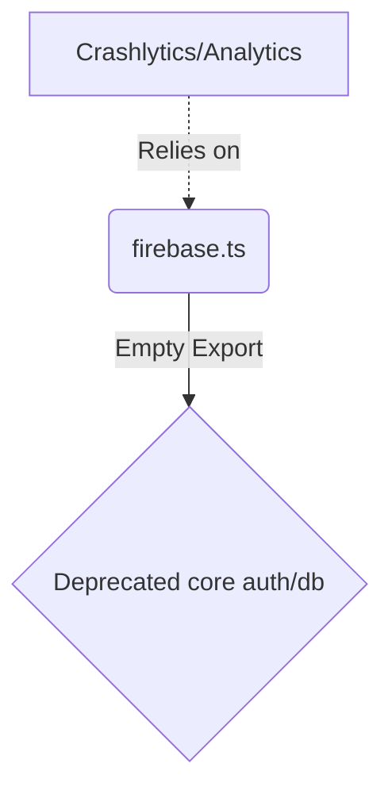

# Documentation: src/api/firebase.ts

## 1. Overview & Role
This file was previously used for initializing Firebase services, including Auth and Firestore. Since the app has migrated its core backend (Authentication and Database) to Supabase, this file has been largely cleared out. Firebase is now *only* retained for Crashlytics and Analytics.

## 2. Imports & Dependencies
There are no imports in this file. (The logging service handles its own imports directly from `@react-native-firebase/crashlytics` and `analytics`).

## 3. Data Structures / Interfaces
None.

## 4. Deep-Dive: Methods & Functions
None. The file only contains an `export {}` statement.
- **Step-by-Step Logic**: `export {}` explicitly marks this file as a module.
- **Modification Guide**: Do not add new Firebase services here. Any backend interactions should go through Supabase. If you need to configure specific Firebase initialization options for Analytics in the future, you could add them here, but typically React Native Firebase initializes automatically.

## 5. Code Examples
```typescript
// No code examples apply.
```

## 6. Data Flow Diagram

