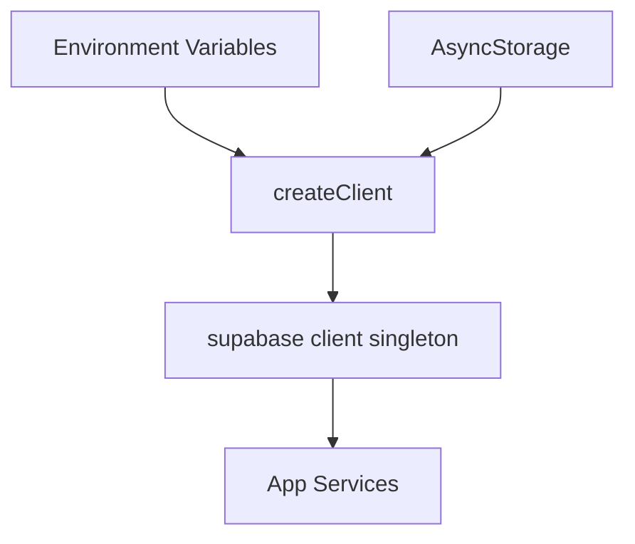

# Documentation: src/api/supabase.ts

## 1. Overview & Role
This file is the absolute core of the app's backend data layer. It initializes and configures the Supabase client, which acts as the main bridge between the frontend (React Native) and the database (Supabase PostgreSQL). Every service that reads, writes, or listens to data will import the `supabase` client from this file.

## 2. Imports & Dependencies
- `createClient` from `@supabase/supabase-js`: The primary function from the Supabase SDK used to create a connection instance.
- `AsyncStorage` from `@react-native-async-storage/async-storage`: React Native's persistent storage mechanism. It is used to save the user's authentication token so they don't have to log in every time they open the app.

## 3. Data Structures / Interfaces
None directly defined in this file.

## 4. Deep-Dive: Methods & Functions

### Supabase Initialization
- **Signature**: `export const supabase = createClient(...)`
- **Purpose**: Creates the singleton Supabase client instance used throughout the app.
- **Step-by-Step Logic**:
  1. It reads `EXPO_PUBLIC_SUPABASE_URL` from the environment variables (`process.env`).
  2. It reads `EXPO_PUBLIC_SUPABASE_ANON_KEY` from the environment variables.
  3. It calls `createClient()` passing the URL, Anon Key, and a configuration object.
  4. In the config object, it specifically sets up `auth`:
     - `storage: AsyncStorage`: Tells Supabase to save login sessions locally on the mobile device.
     - `autoRefreshToken: true`: Automatically refreshes the auth token when it expires.
     - `persistSession: true`: Remembers the user across app restarts.
     - `detectSessionInUrl: false`: Disabled because this is a mobile app, not a web app dealing with OAuth redirect URLs in the browser.
- **Error Handling**: If the environment variables are missing, `createClient` will fail or behave unpredictably. TypeScript ensures we use `!` to assert these exist, but runtime crashes can happen if the `.env` file is missing.
- **Modification Guide**: If you want to change how sessions are stored (e.g., using SecureStore for higher security), you would replace `AsyncStorage` with your new storage adapter in the `auth` configuration block.

## 5. Code Examples
Here is how other files use this exported client:
```typescript
import { supabase } from '../api/supabase';

async function fetchMyData() {
  // Uses the initialized client to query the database
  const { data, error } = await supabase.from('my_table').select('*');
}
```

## 6. Data Flow Diagram

