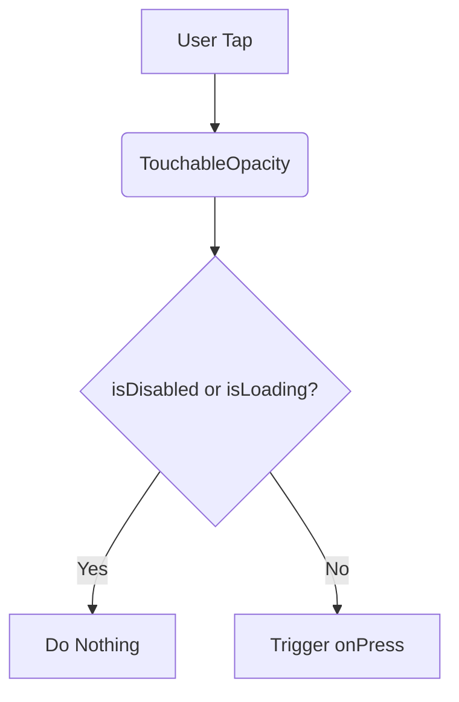

# Button.tsx Documentation

## 1. Overview & Role
The `Button.tsx` file defines a highly reusable, customizable button component used throughout the GiftListApp. It serves as the primary way users trigger actions, like submitting forms, navigating, or closing modals. It supports different variants (primary, secondary, danger), loading states, and optional left or right icons.

## 2. Imports & Dependencies
- `React`: The core library for building React components.
- `TouchableOpacity`, `Text`, `ActivityIndicator`, `StyleSheet`, `ViewStyle`, `TextStyle`, `StyleProp` from `react-native`: These provide the fundamental UI building blocks for a button that responds to touches, renders text/icons, shows loading spinners, and handles styling.
- `FontAwesome5` from `@expo/vector-icons`: Used to render vector icons inside the button.
- `useAppTheme` from `../../theme/ThemeContext`: Provides the dynamic colors (primary, secondary, danger, etc.) for the app's current theme (light or dark mode).

## 3. Data Structures / Interfaces

### `ButtonProps`
Defines the input properties the `Button` component accepts.
- `title: string`: The text displayed on the button.
- `onPress: () => void`: The function called when the button is tapped.
- `variant?: 'primary' | 'secondary' | 'danger'`: The stylistic variant. Defaults to 'primary'.
- `loading?: boolean`: If true, disables the button and shows a spinner.
- `disabled?: boolean`: If true, greys out the button and prevents interaction.
- `icon?: string`: Optional name of the FontAwesome5 icon.
- `iconPosition?: 'left' | 'right'`: Where to place the icon relative to the text.
- `style?: StyleProp<ViewStyle>`: Custom styling for the button container.
- `textStyle?: StyleProp<TextStyle>`: Custom styling for the button text.

## 4. Deep-Dive: Methods & Functions

### `Button` (Component)
- **Signature**: `export const Button = ({ title, onPress, variant = 'primary', loading = false, disabled = false, icon, iconPosition = 'left', style, textStyle }: ButtonProps)`
- **Purpose**: Renders the customizable button UI.
- **Step-by-Step Logic**:
  1. Calls `useAppTheme()` to retrieve the current theme colors.
  2. Defines a helper `getBackgroundColor()` to determine the button's background. If disabled or secondary, uses the border color. If danger, uses danger color. Otherwise, primary color.
  3. Defines a helper `getTextColor()` to determine the text and icon color. Secondary uses the theme text color; others use white (`#FFF`).
  4. Returns a `TouchableOpacity` wrapping the button's contents.
  5. If `loading` is true, an `ActivityIndicator` is shown instead of the text/icon.
  6. If `loading` is false, it renders the optional left icon, the title text, and the optional right icon in that order.
- **Error Handling**: No explicit error throwing. Missing icons fail silently or render a default question mark based on FontAwesome5's behavior.
- **Modification Guide**: To add a new variant, like 'success', add it to `ButtonProps.variant`, update `getBackgroundColor()` to return `colors.success` (if added to the theme), and update `getTextColor()` if needed.

## 5. Code Examples
```tsx
import { Button } from '../common/Button';

// A simple primary button
<Button title="Save" onPress={() => console.log('Saved!')} />

// A danger button with a loading state
<Button 
  title="Delete" 
  variant="danger" 
  loading={true} 
  onPress={handleDelete} 
/>

// A button with an icon
<Button 
  title="Continue" 
  icon="arrow-right" 
  iconPosition="right" 
  onPress={goNext} 
/>
```


## 6. Data Flow Diagram


