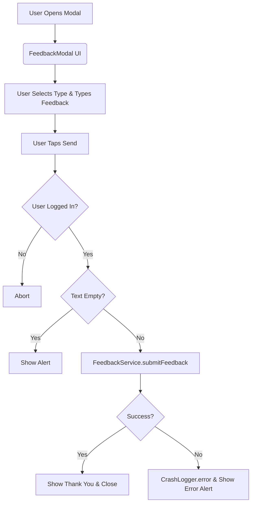

# FeedbackModal.tsx Documentation

## 1. Overview & Role
The `FeedbackModal.tsx` file provides a slide-up modal UI where users can submit feedback, bug reports, or feature requests directly to the development team. It interacts with the `FeedbackService` to store submissions.

## 2. Imports & Dependencies
- `React`, `useState`: Core React imports for component building and state management.
- Various `react-native` components (`Modal`, `View`, `Text`, `TextInput`, `StyleSheet`, `KeyboardAvoidingView`, `Platform`, `TouchableWithoutFeedback`, `Keyboard`, `Alert`, `Switch`, `TouchableOpacity`): Provide the structure and interactions for the modal, specifically handling keyboard popup gracefully.
- `Button` from `./Button`: The custom button component.
- `FeedbackService` from `../../services/FeedbackService`: Handles sending data to the backend.
- `useAuth` from `../../hooks/useAuth`: Retrieves the current logged-in user.
- `CrashLogger` from `../../services/LoggingService`: Logs errors silently if submission fails.

## 3. Data Structures / Interfaces

### `FeedbackModalProps`
- `visible: boolean`: Whether the modal is shown.
- `onClose: () => void`: Callback triggered to hide the modal.

### `FeedbackType`
- Type union: `'general' | 'bug' | 'feature'`. Used to categorize user feedback.

## 4. Deep-Dive: Methods & Functions

### `FeedbackModal` (Component)
- **Signature**: `export const FeedbackModal = ({ visible, onClose }: FeedbackModalProps)`
- **Purpose**: Displays the feedback form.
- **Step-by-Step Logic**:
  1. Extracts `user` from `useAuth()`.
  2. Sets up state for `text`, `loading`, `isAnonymous`, and `type`.
  3. Computes `senderEmail`: either 'anonymous@example.com' or the user's email.
  4. Renders a `Modal` containing a `KeyboardAvoidingView` to prevent the keyboard from blocking the text input.
  5. Displays a row of chips (`TouchableOpacity`) to let the user select the feedback `type`.
  6. Displays a multiline `TextInput` for the feedback body.
  7. Renders a `Switch` to toggle `isAnonymous`.
  8. Renders "Cancel" and "Send" `Button` components.
- **Error Handling**: N/A for rendering.

### `handleSubmit`
- **Signature**: `const handleSubmit = async () =>`
- **Purpose**: Validates and submits the feedback.
- **Step-by-Step Logic**:
  1. Checks if `user` exists; if not, returns early.
  2. Checks if `text` is empty. If so, shows an `Alert` and returns.
  3. Sets `loading` to true.
  4. Calls `FeedbackService.submitFeedback` with the user ID, email, text, type, and anonymity preference.
  5. On success, shows a "Thank You" alert, resets form state (`text`, `type`), and calls `onClose()`.
  6. On failure, catches the error, logs it with `CrashLogger.error`, and shows an error `Alert`.
  7. Finally block sets `loading` to false.
- **Error Handling**: Catches network/backend errors, logs them, and informs the user via an Alert.
- **Modification Guide**: To add a new feedback type like "complaint", add it to the `FeedbackType` union, then add a chip for it in the rendering array `['general', 'bug', 'feature', 'complaint']`.

## 5. Code Examples
```tsx
import { FeedbackModal } from './FeedbackModal';

const [showFeedback, setShowFeedback] = useState(false);

<FeedbackModal 
  visible={showFeedback} 
  onClose={() => setShowFeedback(false)} 
/>
```


## 6. Data Flow Diagram


