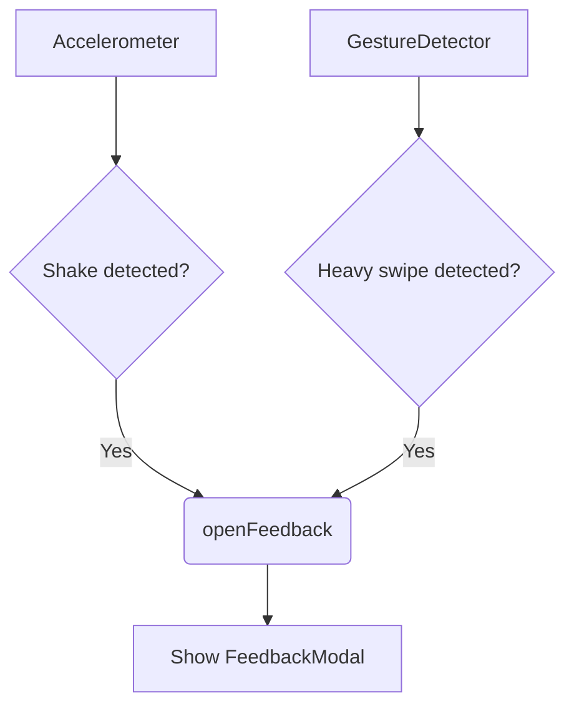

# FeedbackTrigger.tsx Documentation

## 1. Overview & Role
The `FeedbackTrigger.tsx` component is a global wrapper meant to encapsulate the entire app or a large portion of it. It silently listens in the background for a physical device shake or a hard horizontal edge swipe. When detected, it opens the `FeedbackModal`.

## 2. Imports & Dependencies
- `React`, `useEffect`, `useState`, `useRef`: React hooks for lifecycle, state, and mutable references without triggering re-renders.
- `StyleSheet`, `View`, `Platform` from `react-native`: Standard layout components.
- `GestureDetector`, `Gesture` from `react-native-gesture-handler`: For detecting the rapid horizontal swipe gesture.
- `Accelerometer` from `expo-sensors`: For reading device movement to detect shakes.
- `FeedbackModal` from `./FeedbackModal`: The UI modal shown when triggered.
- `useFeedback` from `../../theme/FeedbackContext`: Accesses global state to open/close the feedback modal safely without multiple instances popping up.

## 3. Data Structures / Interfaces
No explicit TypeScript interfaces, it just takes `{ children: React.ReactNode }` to wrap other components.

## 4. Deep-Dive: Methods & Functions

### `FeedbackTrigger` (Component)
- **Signature**: `export const FeedbackTrigger = ({ children }: { children: React.ReactNode })`
- **Purpose**: Listens for specific physical triggers (shake, swipe) to invoke the feedback UI.
- **Step-by-Step Logic**:
  1. Pulls state and mutators from `useFeedback()`.
  2. Sets up a reference for `lastUpdate` to debounce shake events (preventing multiple firings per second).
  3. Defines `_subscribe` to listen to the accelerometer and `_unsubscribe` to clean it up.
  4. Runs a `useEffect` that calls `_subscribe` on mount and `_unsubscribe` on unmount.
  5. Defines `gesture` using `Gesture.Pan()` that checks for high velocity horizontal movement.
  6. Wraps `children` and the `FeedbackModal` inside a `GestureDetector` and a `View`.
- **Modification Guide**: To change the swipe trigger to a long press, change `Gesture.Pan()` to `Gesture.LongPress().onStart(...)`.

### `_subscribe` (Accelerometer listener)
- **Signature**: `const _subscribe = () =>`
- **Purpose**: Starts listening to accelerometer data.
- **Step-by-Step Logic**:
  1. Sets update interval to 100ms for quick response.
  2. Subscribes to changes, extracting x, y, z forces.
  3. Calculates total physical force: `Math.sqrt(x*x + y*y + z*z)`.
  4. If force exceeds 2.5 (gravity is 1.0) and 2000ms have passed since the last trigger, it assumes a shake occurred.
  5. If the modal isn't already visible, it calls `openFeedback()`.
- **Error Handling**: Sensor unavailability isn't explicitly caught; `expo-sensors` typically handles missing sensors safely.
- **Modification Guide**: To make the app require a harder shake, increase the force threshold from `2.5` to `3.5`.

### `gesture` definition
- **Signature**: `const gesture = Gesture.Pan().onFinalize(...)`
- **Purpose**: Detects a heavy swipe.
- **Step-by-Step Logic**:
  1. On finalize (end of swipe), checks if successful.
  2. Looks at horizontal translation (`translationX`), velocity (`velocityX`), and vertical translation (`translationY`).
  3. If horizontal distance > 150 AND velocity > 800, AND horizontal movement is at least double the vertical movement (to avoid diagonal swiping firing it), it calls `openFeedback()`.
- **Modification Guide**: To make the swipe more sensitive, lower the `velocityX` check from 800 to 500.

## 5. Code Examples
```tsx
import { FeedbackTrigger } from './components/common/FeedbackTrigger';

// In App.tsx or Root Layout
export default function App() {
  return (
    <FeedbackProvider>
      <FeedbackTrigger>
        <NavigationContainer>
           {/* App Screens Here */}
        </NavigationContainer>
      </FeedbackTrigger>
    </FeedbackProvider>
  );
}
```


## 6. Data Flow Diagram


