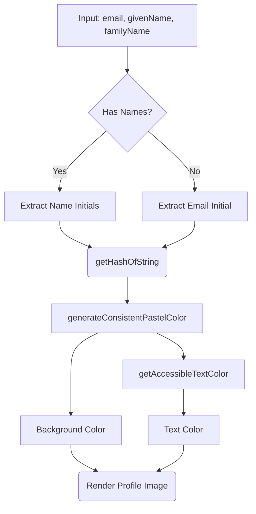

# ProfileImage.tsx Documentation

## 1. Overview & Role
The `ProfileImage.tsx` file provides a component to display a user's avatar. Since users might not upload a photo, this component generates a consistent, aesthetically pleasing pastel-colored circle with their initials based on their name or email.

## 2. Imports & Dependencies
- `React`, `useMemo`: For creating the component and caching the color generation so it doesn't recalculate on every frame.
- `StyleSheet`, `Dimensions`, `View`, `Text`, `ViewStyle`, `StyleProp`, `TouchableOpacity` from `react-native`: Standard UI components for rendering the circle, text, and allowing it to be tapped.

## 3. Data Structures / Interfaces

### `ProfileImageProps`
- `email: string`: User's email. Used as a fallback for initials and primary source for color hashing.
- `givenName: string`: First name.
- `familyName: string`: Last name.
- `size?: number`: Dimensions (width and height). Defaults to 40.
- `onPress?: () => void`: Optional callback if the avatar is tappable.
- `style?: StyleProp<ViewStyle>`: Additional styling.

## 4. Deep-Dive: Methods & Functions

### `getHashOfString`
- **Signature**: `const getHashOfString = (str: string)`
- **Purpose**: Converts any string into a deterministic integer.
- **Step-by-Step Logic**: Iterates through each character, getting the character code, and shifting bits (`hash << 5`) to generate a unique hash integer.

### `generateConsistentPastelColor`
- **Signature**: `const generateConsistentPastelColor = (name: string)`
- **Purpose**: Turns a string hash into a soft pastel hex color.
- **Step-by-Step Logic**:
  1. Gets the integer hash from the string.
  2. Uses bitwise masking to extract red (`& 0xFF0000`), green, and blue values.
  3. Mixes each channel with white (255) and divides by 2 to ensure it is pastel and light.
  4. Returns the `#RRGGBB` hex string.
- **Modification Guide**: To make colors darker instead of pastel, change the `mixWithWhite` function to mix with a dark color or just remove the mixing entirely.

### `getAccessibleTextColor`
- **Signature**: `const getAccessibleTextColor = (hexColor: string)`
- **Purpose**: Returns either black or white text depending on the background color's perceived brightness.
- **Step-by-Step Logic**: Calculates the YIQ brightness. If >= 128, the background is light, so it returns black (`#000000`). Otherwise, it returns white (`#FFFFFF`).

### `ProfileImage` (Component)
- **Signature**: `const ProfileImage = ({ email, givenName, familyName, size = 40, onPress, style }: ProfileImageProps)`
- **Purpose**: Renders the avatar UI.
- **Step-by-Step Logic**:
  1. Determines initials: grabs first letter of `givenName` and `familyName`.
  2. If both are empty, uses the first letter of `email`.
  3. Uses `useMemo` to call `generateConsistentPastelColor` with the email to set the background color.
  4. Uses `useMemo` to call `getAccessibleTextColor` to set the text color.
  5. Calculates font size as 40% of the avatar size.
  6. Renders a `TouchableOpacity` containing the initials text.
- **Modification Guide**: To support a custom uploaded profile picture, add an `imageUrl?: string` prop. In the render function, check if `imageUrl` exists; if so, render an `Image` component; if not, render the initials logic.

## 5. Code Examples
```tsx
import ProfileImage from '../common/ProfileImage';

<ProfileImage 
  givenName="John" 
  familyName="Doe" 
  email="johndoe@example.com" 
  size={60} 
/>
```


## 6. Data Flow Diagram


