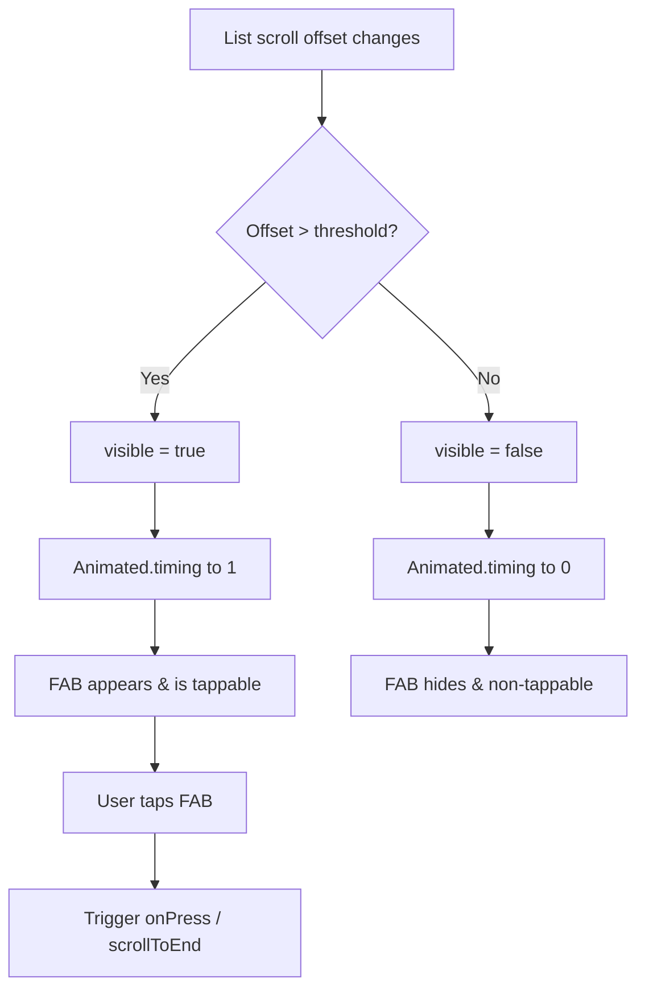

# ScrollToBottomFab.tsx Documentation

## 1. Overview & Role
The `ScrollToBottomFab.tsx` component is a Floating Action Button (FAB) that appears when a user scrolls up in a long list (like a chat or long gift list) and allows them to quickly jump back to the bottom. It features a smooth fade and scale-in animation.

## 2. Imports & Dependencies
- `React`, `useEffect`, `useRef`: Core hooks for handling component lifecycle and maintaining the animated value reference.
- `Animated`, `TouchableOpacity`, `Text`, `StyleSheet` from `react-native`: UI building blocks. `Animated` powers the scaling and opacity transitions.

## 3. Data Structures / Interfaces

### `ScrollToBottomFabProps`
- `visible: boolean`: Controls whether the FAB should be shown or hidden on screen.
- `onPress: () => void`: The action triggered when the FAB is tapped (typically a scroll command).

## 4. Deep-Dive: Methods & Functions

### `ScrollToBottomFab` (Component)
- **Signature**: `export const ScrollToBottomFab = ({ visible, onPress }: ScrollToBottomFabProps)`
- **Purpose**: Renders the animated floating button.
- **Step-by-Step Logic**:
  1. Initializes `fabAnim` as a `useRef` containing an `Animated.Value` starting at 1 if visible, 0 if not.
  2. `useEffect` watches the `visible` prop. When it changes, `Animated.timing` animates the value to 1 or 0 over 250ms using the native driver for performance.
  3. Renders an `Animated.View` wrapping a `TouchableOpacity`.
  4. The view's style dynamically sets `opacity` to `fabAnim` and `transform.scale` using `interpolate` (scaling from 0 to 1).
  5. Crucially, sets `pointerEvents={visible ? 'auto' : 'none'}` so invisible buttons can't be accidentally tapped.
  6. Uses nativewind/Tailwind utility classes (e.g. `items-center justify-center h-16 w-16 bg-blue-600 rounded-full`) for styling the inner button.
- **Error Handling**: N/A.
- **Modification Guide**: To change the icon from a text arrow "↓" to an actual icon, import `FontAwesome5` and replace the `<Text>` node with `<FontAwesome5 name="arrow-down" size={24} color="#FFF" />`. To change the color, update the Tailwind classes in the `className` string.

## 5. Code Examples
```tsx
import { ScrollToBottomFab } from '../common/ScrollToBottomFab';

// Inside a component with a FlatList
const [showFab, setShowFab] = useState(false);
const listRef = useRef<FlatList>(null);

<FlatList 
  onScroll={(e) => setShowFab(e.nativeEvent.contentOffset.y > 100)}
/>

<ScrollToBottomFab 
  visible={showFab} 
  onPress={() => listRef.current?.scrollToEnd()} 
/>
```


## 6. Data Flow Diagram


