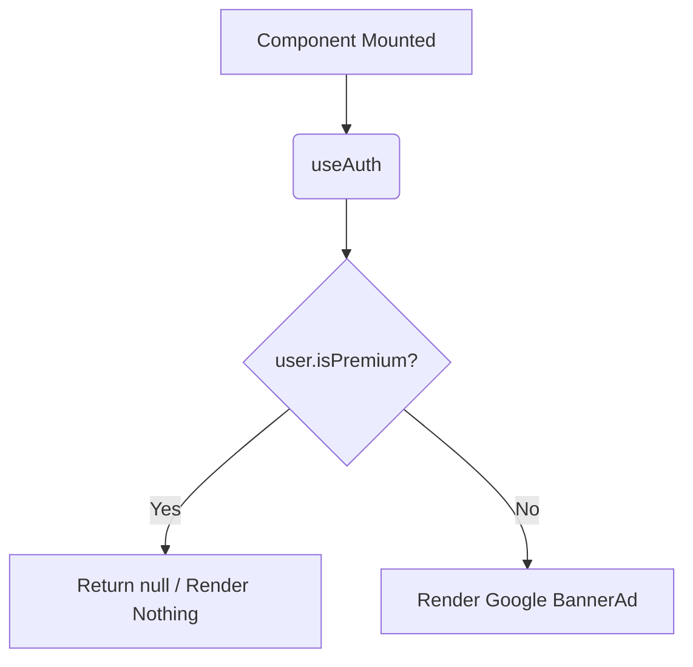

# SmartAdBanner.tsx Documentation

## 1. Overview & Role
The `SmartAdBanner.tsx` file defines a component intended to display Google AdMob banners in the app. Currently, the code is entirely commented out. Its design suggests a "smart" approach where the ad only renders if the current user is not a premium subscriber.

## 2. Imports & Dependencies
*(All currently commented out)*
- `React`: Core React library.
- `View`, `Text`, `StyleSheet` from `react-native`: Basic layout structures.
- `BannerAd`, `BannerAdSize`, `TestIds` from `react-native-google-mobile-ads`: The Google Ads SDK components.
- `useAuth` from `../../hooks/useAuth`: Hook to check the current user's subscription status.

## 3. Data Structures / Interfaces
No explicit interfaces. Operates without props by pulling user context from `useAuth()`.

## 4. Deep-Dive: Methods & Functions

### `SmartAdBanner` (Component) - *Commented Out*
- **Signature**: `export const SmartAdBanner = () =>`
- **Purpose**: Displays an adaptive banner ad at the bottom of screens for free-tier users.
- **Step-by-Step Logic**:
  1. Calls `useAuth()` to get the `user` object.
  2. Gatekeeper Check: Evaluates `if (user?.isPremium)`. If true, returns `null` and renders nothing.
  3. Returns a `View` containing a "Sponsored" label and the `BannerAd` component.
  4. The `BannerAd` requests an `ANCHORED_ADAPTIVE_BANNER` using a test ID in development or real ID in production.
- **Error Handling**: Missing ad loads are typically handled internally by the `react-native-google-mobile-ads` SDK, but no explicit error callbacks are defined here.
- **Modification Guide**: To reactivate this component, uncomment the code. You will need to ensure `react-native-google-mobile-ads` is properly configured in `app.json` and the Podfile. Change `'YOUR-REAL-BANNER-ID'` to an actual AdMob unit ID.

## 5. Code Examples
```tsx
// Example usage if uncommented
import { SmartAdBanner } from '../common/SmartAdBanner';

<View style={{ flex: 1 }}>
  <MainContent />
  <SmartAdBanner />
</View>
```


## 6. Data Flow Diagram


