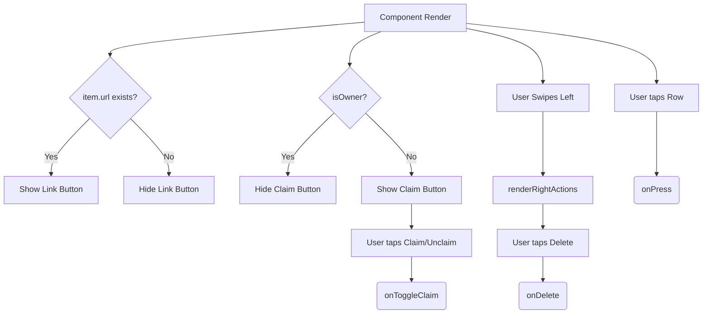

# GiftItemRow.tsx Documentation

## 1. Overview & Role
The `GiftItemRow.tsx` component represents a single item inside a user's gift list. It handles displaying the item's details (image, name, price), showing badges (like substitution allowed), providing a claim button (if viewed by another user), and swipe-to-delete functionality for the owner.

## 2. Imports & Dependencies
- `React`: Core library.
- `View`, `Text`, `StyleSheet`, `TouchableOpacity`, `Image`, `Linking`, `Animated` from `react-native`: UI rendering, URL handling, and animations.
- `Swipeable` from `react-native-gesture-handler`: Adds the swipe-to-reveal-delete-button behavior.
- `FontAwesome5` from `@expo/vector-icons`: Iconography.
- Types (`GiftItem`, `GiftItemUI`, `ItemClaim`) from `../../types/models`: Data interfaces.
- `useAppTheme` from `../../theme/ThemeContext`: For dynamic theming colors.

## 3. Data Structures / Interfaces

### `GiftItemRowProps`
Extends `GiftItemUI`.
- `item: GiftItem`: The core item data.
- `claim: ItemClaim`: The claim status data.
- `onPress: () => void`: Action when the row is tapped.
- `onDelete: (id: string) => void`: Action when deleted.
- Style props (`containerStyle`, `cardStyle`, etc.): Custom overrides.
- `revealWidth?: number`: How far the swipeable action opens (default 100).
- `currentUserId: string`: ID of the logged-in user.
- `isOwner: boolean`: True if the current user owns this list.
- `onToggleClaim: (itemId: string, currentClaimer: string | null) => void`: Function to claim/unclaim.

## 4. Deep-Dive: Methods & Functions

### `renderRightActions`
- **Signature**: `const renderRightActions = (progress: Animated.AnimatedInterpolation<number>)`
- **Purpose**: Defines the UI that appears when you swipe left on the row (the delete button).
- **Step-by-Step Logic**:
  1. Interpolates the `progress` value to create a `scale` effect for the trash icon.
  2. Returns a red `View` containing a `TouchableOpacity` button with the trash icon.
  3. When pressed, calls `onDelete(item.id)`.
- **Modification Guide**: To add an "Edit" button next to Delete, you would add another `TouchableOpacity` alongside this one, divide the `revealWidth`, and style it blue or gray.

### `handleLinkPress`
- **Signature**: `const handleLinkPress = async () =>`
- **Purpose**: Safely opens the item's purchase URL in the device's web browser.
- **Step-by-Step Logic**:
  1. Checks if `item.url` exists.
  2. Calls `Linking.canOpenURL`.
  3. If true, calls `Linking.openURL(item.url)`.

### `GiftItemRow` (Component Render)
- **Signature**: `export const GiftItemRow = ({...}: GiftItemRowProps)`
- **Purpose**: Renders the complete row.
- **Step-by-Step Logic**:
  1. Extracts boolean flags: `isClaimed`, `isClaimedByMe`. Formats `displayPrice`.
  2. Returns a `TouchableOpacity` representing the main card. If `isClaimed` and not by the current user, it applies a `cardDimmed` style (opacity reduction).
  3. Image Section: If `item.imageUri` exists, shows an `Image`; otherwise, shows a placeholder view with an icon.
  4. Content Section: Renders name and price. If a description exists, renders it up to 3 lines.
  5. Badge Row: Checks for `substitutions` boolean and renders a badge if true. Renders the URL link button if a URL exists.
  6. Claim Action: If the viewer is NOT the owner (`!isOwner`), it renders the Claim button. The styling changes dynamically (primary color for Claim, gray for Claimed, red for Unclaim) based on the claim state. Pressing it triggers `onToggleClaim`.
- **Error Handling**: `Linking.canOpenURL` catches invalid URL structures silently.
- **Modification Guide**: To change the currency symbol from `$` to `€` or `£`, locate the `displayPrice` variable assignment and update the string formatting. To implement localization, pass a currency prop down.

## 5. Code Examples
```tsx
<GiftItemRow
  item={itemData}
  claim={itemData.claimStatus}
  currentUserId={user.uid}
  isOwner={listOwnerId === user.uid}
  onPress={() => openDetailModal(itemData)}
  onDelete={(id) => deleteItem(id)}
  onToggleClaim={handleClaim}
/>
```


## 6. Data Flow Diagram


