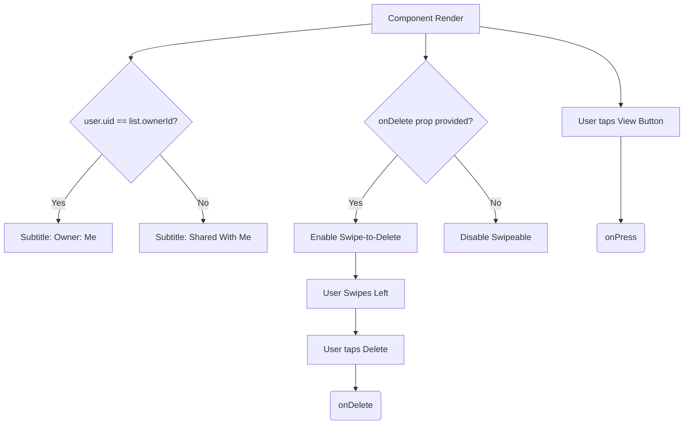

# GiftListRow.tsx Documentation

## 1. Overview & Role
The `GiftListRow.tsx` component represents a single list item on the Dashboard (e.g., "My Birthday List", "Mom's Wishlist"). It allows users to tap to view the list contents or swipe to delete the list (if they have permission).

## 2. Imports & Dependencies
- `React`: Core library.
- `View`, `Text`, `StyleSheet`, `TouchableOpacity`, `Animated` from `react-native`: Layout and interactions.
- `Swipeable` from `react-native-gesture-handler`: Powers the swipe-to-delete action.
- `FontAwesome5`: Icons.
- `Button` from `../common/Button`: Renders the "View" button on the card.
- `GiftList` from `../../types/models`: Type definition for the list data.
- `useAuth`: Hook to get the current user ID for ownership checks.
- `useAppTheme`: Hook for dynamic colors.

## 3. Data Structures / Interfaces

### `GiftListRowProps`
- `list: GiftList`: The list data object.
- `onPress: () => void`: Navigation action when tapped.
- `onDelete?: (id: string) => void`: Optional callback for deleting the list.
- Style props (`containerStyle`, `cardStyle`, etc.): Custom visual overrides.
- `revealWidth?: number`: Width of the swipeable underlay.

## 4. Deep-Dive: Methods & Functions

### `renderRightActions`
- **Signature**: `const renderRightActions = (progress: Animated.AnimatedInterpolation<number>)`
- **Purpose**: Creates the UI that sits underneath the row, exposed by swiping left.
- **Step-by-Step Logic**:
  1. Interpolates `progress` for a scale effect on the trash icon.
  2. Returns a red container view holding a button.
  3. Pressing the button calls the `onDelete` prop (using optional chaining `?.` in case it wasn't provided).
- **Modification Guide**: To change the background color of the swipe action to orange, change `backgroundColor: colors.danger` to `backgroundColor: 'orange'` in the array passed to the style prop.

### `GiftListRow` (Component Render)
- **Signature**: `export const GiftListRow = ({...}: GiftListRowProps)`
- **Purpose**: Main render function for the list row card.
- **Step-by-Step Logic**:
  1. Calls `useAuth()` to get `user.uid`.
  2. Returns a `View` container containing a `Swipeable`.
  3. The `Swipeable` only has `renderRightActions` attached if an `onDelete` prop was passed (so non-owners can't swipe).
  4. Inside the `Swipeable`, it renders a styled `View` (the visible card).
  5. It prints the `list.title`.
  6. It compares `list.ownerId` with `user.uid` to render the subtitle as either "Owner: Me" or "Shared With Me".
  7. Renders the generic `Button` component titled "View" which triggers the `onPress` callback.
- **Error Handling**: Safely uses optional chaining `user?.uid` to avoid crashes if auth state is momentarily null.

## 5. Code Examples
```tsx
<GiftListRow
  list={listData}
  onPress={() => navigation.navigate('ListDetails', { id: listData.id })}
  onDelete={(id) => confirmDelete(id)}
/>
```


## 6. Data Flow Diagram


