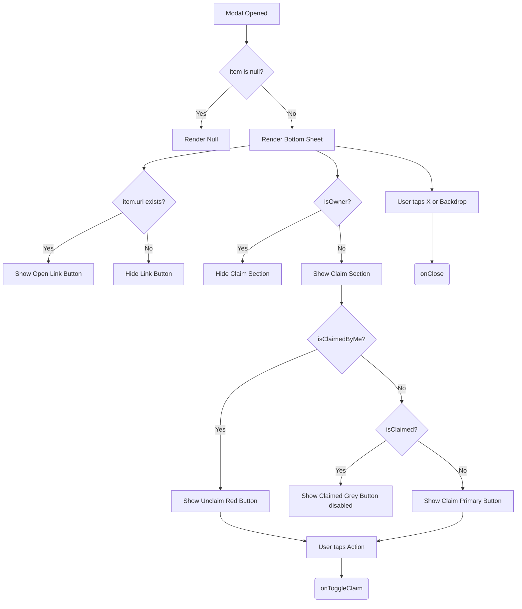

# ItemDetailModal.tsx Documentation

## 1. Overview & Role
The `ItemDetailModal.tsx` file defines a large, bottom-sheet style popup that shows the full details of a gift item when tapped. It displays a larger image, full description, price, external links, and provides a prominent "Claim" button for viewers.

## 2. Imports & Dependencies
- `React`: Core library.
- `Modal`, `View`, `Text`, `Image`, `ScrollView`, `TouchableOpacity`, `StyleSheet`, `Linking`, `Pressable` from `react-native`: Standard structural and interactive components. `ScrollView` allows long descriptions to scroll. `Linking` handles opening URLs.
- `FontAwesome5`: For icons (close button, gift icon placeholder, link icon).
- `GiftItemUI`, `ItemClaim`: Type definitions.
- `useAppTheme`: Dynamic theming.

## 3. Data Structures / Interfaces

### `Props`
- `item: GiftItemUI | null`: The item to display. If null, the modal hides.
- `isOwner: boolean`: Determines if the claim button is hidden.
- `currentUserId: string`: Used to check if the current user claims the item.
- `onClose: () => void`: Closes the modal.
- `onToggleClaim: (itemId: string, claimer: string | null) => void`: Updates the claim status.

## 4. Deep-Dive: Methods & Functions

### `handleLink`
- **Signature**: `const handleLink = async () =>`
- **Purpose**: Opens the item's purchase link.
- **Step-by-Step Logic**:
  1. Verifies `item.url` exists.
  2. Uses `Linking.canOpenURL` to ensure the device supports the link format.
  3. Uses `Linking.openURL` to launch the external browser.

### `ItemDetailModal` (Component)
- **Signature**: `export const ItemDetailModal = ({ item, isOwner, currentUserId, onClose, onToggleClaim }: Props)`
- **Purpose**: Renders the detail popup.
- **Step-by-Step Logic**:
  1. Early return: If `item` is null, returns `null` (renders nothing).
  2. Calculates claim statuses: `isClaimed` (anyone), `isClaimedByMe` (specifically this user). Formats the price.
  3. Returns a `Modal` set to `transparent` and `animationType="slide"`.
  4. Renders a `Pressable` backdrop that calls `onClose()` when tapped (closes modal when clicking outside).
  5. The main UI is a `View` styled as a bottom sheet.
  6. Renders an absolute-positioned close button (`X` icon) at the top right.
  7. Renders a `ScrollView` for the content.
  8. Shows a large `Image` if `imageUri` exists; else, a grey box with a gift icon.
  9. Renders `name`, `price`, and `description`.
  10. If `item.substitutions` is true, shows a green badge.
  11. If `item.url` exists, shows a large "Open Link" button.
  12. If `!isOwner`, renders the Claim Button at the bottom. Color logic: Red if claimed by me (action: Unclaim), Grey if claimed by someone else (disabled), Primary if available.
- **Modification Guide**: To add an item rating system, you would insert star icons (`FontAwesome5 name="star"`) below the item name inside the `ScrollView`. 

## 5. Code Examples
```tsx
const [selectedItem, setSelectedItem] = useState<GiftItemUI | null>(null);

<ItemDetailModal
  item={selectedItem}
  isOwner={false}
  currentUserId={user.uid}
  onClose={() => setSelectedItem(null)}
  onToggleClaim={handleClaimAction}
/>
```


## 6. Data Flow Diagram


