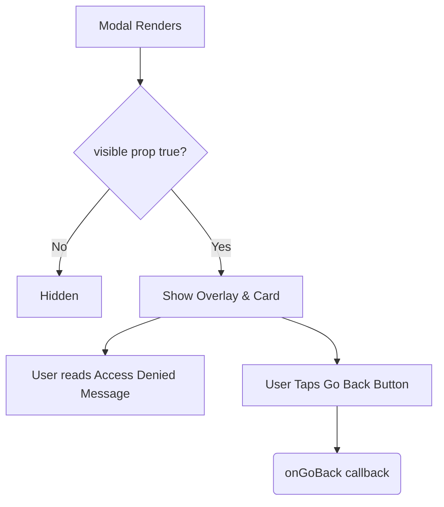

# AccessDeniedModal.tsx Documentation

## 1. Overview & Role
The `AccessDeniedModal.tsx` file provides a simple alert popup that appears if a user attempts to access a list they do not have permission to view (e.g., trying to use an invalid or expired share code, or directly navigating to a private list ID).

## 2. Imports & Dependencies
- `React`: Core library.
- `Modal`, `View`, `Text`, `StyleSheet` from `react-native`: Standard structural components.
- `useAppTheme`: Dynamic theming for dark/light mode compatibility.
- `Button` from `../common/Button`: The standard app button used to dismiss the modal.

## 3. Data Structures / Interfaces

### `AccessDeniedModalProps`
- `visible: boolean`: Whether the modal is active.
- `onGoBack: () => void`: The action triggered when the user clicks the button, typically navigating them back to the dashboard.

## 4. Deep-Dive: Methods & Functions

### `AccessDeniedModal` (Component)
- **Signature**: `export const AccessDeniedModal = ({ visible, onGoBack }: AccessDeniedModalProps)`
- **Purpose**: Displays a blocking UI informing the user of a permission error.
- **Step-by-Step Logic**:
  1. Retrieves `colors` from the theme.
  2. Renders a full-screen React Native `Modal` (`transparent={true}`, `animationType="fade"`).
  3. Inside, creates a dark overlay (`styles.modalOverlay`).
  4. Centers a white/dark-mode card (`styles.modalContent`).
  5. Displays the static text: "Access Denied" and "You do not have permission to view this list."
  6. Renders the `Button` with title "Go Back" that triggers `onGoBack`.
- **Error Handling**: N/A.
- **Modification Guide**: To change the text dynamically based on the error, add an `errorMessage: string` to the props interface, pass it into the component, and replace the hardcoded "You do not have permission..." text with `{errorMessage}`.

## 5. Code Examples
```tsx
import { AccessDeniedModal } from '../modals/AccessDeniedModal';

<AccessDeniedModal 
  visible={hasError === 'not-authorized'} 
  onGoBack={() => navigation.navigate('Dashboard')} 
/>
```


## 6. Data Flow Diagram


