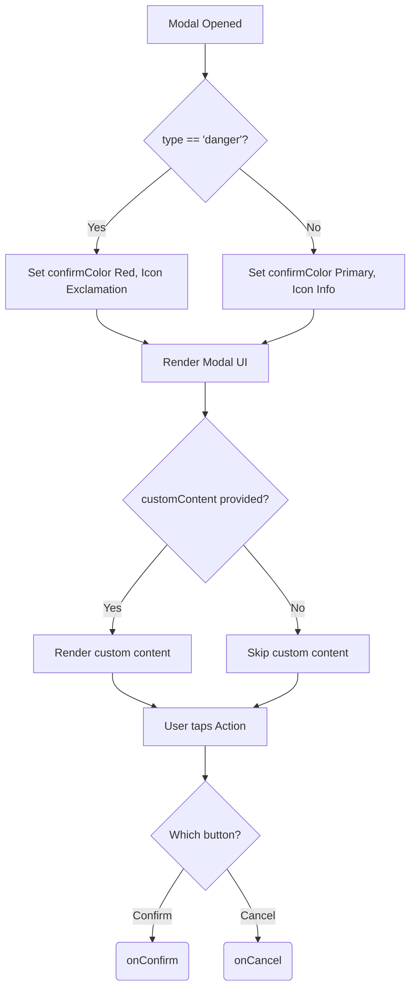

# Confirmation.tsx Documentation

## 1. Overview & Role
The `Confirmation.tsx` file provides a highly reusable confirmation dialog box (`ConfirmationModal`). It is used throughout the app whenever a user attempts a destructive or important action (like deleting a list or signing out) and prompts them to confirm or cancel.

## 2. Imports & Dependencies
- `React`: Core library.
- `Modal`, `View`, `Text`, `TouchableOpacity`, `StyleSheet` from `react-native`: Layout and interaction building blocks.
- `FontAwesome5`: For rendering icons next to the title.
- `useAppTheme`, `ThemeColors` from `../../theme/ThemeContext`: Used to dynamically style the modal based on light/dark mode and color types (danger vs primary).

## 3. Data Structures / Interfaces

### `ConfirmationModalProps`
- `visible: boolean`: Whether the modal is shown.
- `title: string`: The bold title at the top of the modal.
- `message: string`: The descriptive text explaining the action.
- `onConfirm: () => void`: Action executed if confirmed.
- `onCancel: () => void`: Action executed if canceled.
- `confirmText?: string`: Text for the confirm button (default: "Confirm").
- `cancelText?: string`: Text for the cancel button (default: "Cancel").
- `type?: 'danger' | 'info'`: Modifies styling. `danger` makes the confirm button and icon red. `info` makes them the primary app color.
- `customContent?: React.ReactNode`: Optional prop to inject additional UI (like a text input) between the message and buttons.

## 4. Deep-Dive: Methods & Functions

### `ConfirmationModal` (Component)
- **Signature**: `export const ConfirmationModal = ({...}: ConfirmationModalProps)`
- **Purpose**: Renders the modal.
- **Step-by-Step Logic**:
  1. Grabs `colors` from the theme.
  2. Initializes `styles` by passing `colors` to `createStyles`.
  3. Determines `iconName` based on `type` (exclamation triangle for danger, info circle for info).
  4. Determines `confirmColor` based on `type`.
  5. Renders a `Modal`.
  6. Renders a dark, semi-transparent overlay `View`.
  7. Renders the main content card.
  8. Renders a header containing the icon and `title`.
  9. If `message` exists, renders it.
  10. Renders any `customContent` passed in.
  11. Renders the `onConfirm` button, styled with `confirmColor`.
  12. Renders the `onCancel` button underneath as plain text.
- **Modification Guide**: To add a third button option (like "Save Draft"), you would add a new prop (e.g., `onDraft?: () => void`), and render a third `TouchableOpacity` between the confirm and cancel buttons.

### `createStyles`
- **Signature**: `const createStyles = (colors: ThemeColors) => StyleSheet.create({...})`
- **Purpose**: A function that generates styles based on the current theme colors, ensuring the modal adapts to dark mode.

## 5. Code Examples
```tsx
const [showConfirm, setShowConfirm] = useState(false);

<ConfirmationModal
  visible={showConfirm}
  title="Delete List?"
  message="Are you sure you want to permanently delete this list?"
  type="danger"
  confirmText="Yes, Delete"
  onConfirm={() => executeDelete()}
  onCancel={() => setShowConfirm(false)}
/>
```


## 6. Data Flow Diagram


