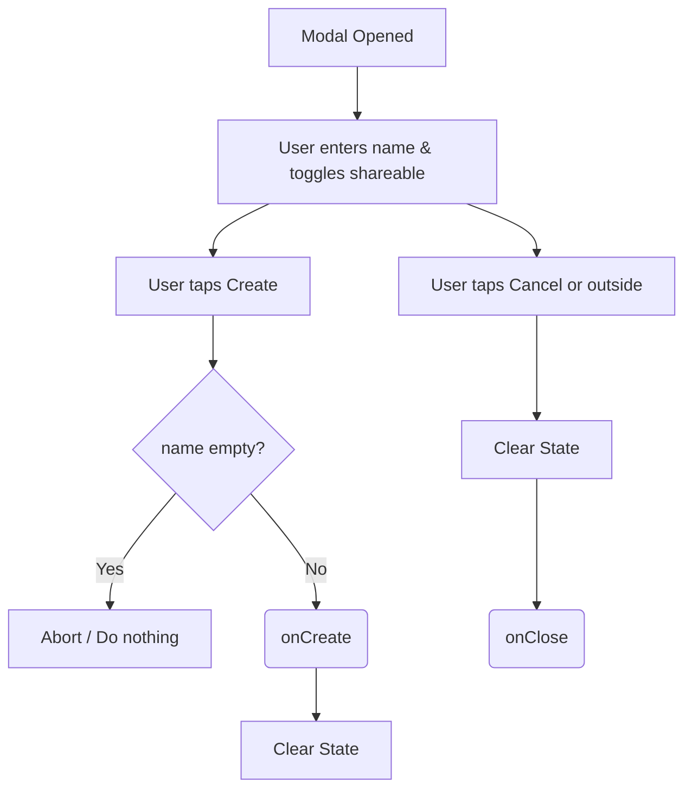

# CreateList.tsx Documentation

## 1. Overview & Role
The `CreateList.tsx` component handles the UI for generating a new gift list. It provides a modal containing a text input for the list name and a toggle switch to mark the list as shareable, allowing friends to view it.

## 2. Imports & Dependencies
- `React`, `useState`: Core state management.
- `View`, `Text`, `TextInput`, `TouchableOpacity`, `Modal`, `StyleSheet`, `Switch`, `ActivityIndicator`, `KeyboardAvoidingView`, `Platform`, `TouchableWithoutFeedback`, `Keyboard` from `react-native`: Used to build a responsive, keyboard-safe form interface.
- `FontAwesome5`: Icon rendering.
- `useAppTheme`, `ThemeColors`: Dark/light mode styling.

## 3. Data Structures / Interfaces

### `CreateListModalProps`
- `visible: boolean`: Toggles the modal display.
- `onClose: () => void`: Closes the modal.
- `onCreate: (name: string, isSharable: boolean) => void`: Callback triggered when the form is submitted.
- `loading?: boolean`: Disables inputs and shows a spinner during network requests.

## 4. Deep-Dive: Methods & Functions

### `handleCreate`
- **Signature**: `const handleCreate = () =>`
- **Purpose**: Validates input and triggers the creation process.
- **Step-by-Step Logic**:
  1. Checks if `name.trim().length === 0`. If the input is empty or just spaces, it aborts (returns early).
  2. Calls `onCreate(name.trim(), isSharable)`.
  3. Resets local state (`name` to empty, `isSharable` to false) so the form is clean for the next time it opens.

### `handleClose`
- **Signature**: `const handleClose = () =>`
- **Purpose**: Cleans up the form before closing.
- **Step-by-Step Logic**:
  1. Resets `name` and `isSharable`.
  2. Calls `onClose()`.

### `CreateListModal` (Component)
- **Signature**: `export const CreateListModal = ({...}: CreateListModalProps)`
- **Purpose**: Renders the form.
- **Step-by-Step Logic**:
  1. Initializes state and theme.
  2. Wraps everything in a `Modal` and a `KeyboardAvoidingView` so the keyboard doesn't cover the input.
  3. Uses `TouchableWithoutFeedback` to dismiss the keyboard if the user taps outside the input.
  4. Renders header (icon + title).
  5. Renders `TextInput` bound to `name` state.
  6. Renders a `Switch` bound to `isSharable` state.
  7. Renders action buttons. The "Create" button is disabled if `name` is empty or if `loading` is true. Shows an `ActivityIndicator` if `loading`.
- **Modification Guide**: To add a description field for the list, add a `[description, setDescription] = useState('')` hook, add another `TextInput` below the name input, and update `onCreate` to accept the description as a third parameter.

## 5. Code Examples
```tsx
const [showCreate, setShowCreate] = useState(false);

<CreateListModal
  visible={showCreate}
  loading={isSubmitting}
  onClose={() => setShowCreate(false)}
  onCreate={async (name, isSharable) => {
    await api.createList({ name, isSharable });
    setShowCreate(false);
  }}
/>
```


## 6. Data Flow Diagram


