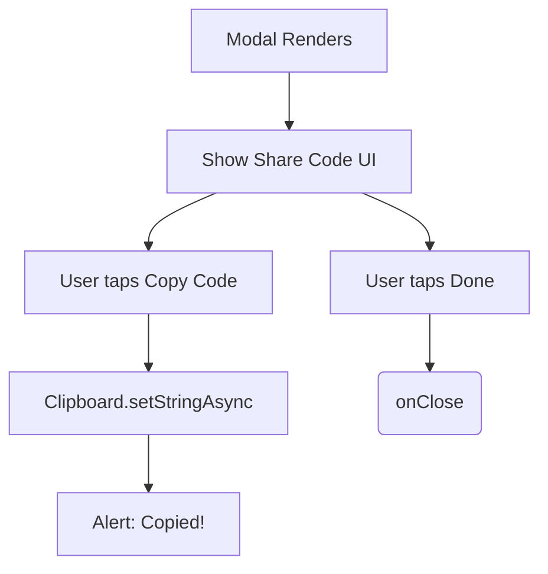

# ShareCodeModal.tsx Documentation

## 1. Overview & Role
The `ShareCodeModal.tsx` file provides a UI to display a 6-digit alphanumeric code to the user after they create a shareable list. It includes a convenient button to copy the code to the device's clipboard.

## 2. Imports & Dependencies
- `React`: Core library.
- `View`, `Text`, `TouchableOpacity`, `Modal`, `StyleSheet`, `Alert` from `react-native`: Standard UI layout and alerts.
- `* as Clipboard` from `expo-clipboard`: Used to copy the code to the system clipboard so the user can paste it in a text message.
- `FontAwesome5`: Icon rendering (the copy icon).
- `useAppTheme`, `ThemeColors`: Theming tools.

## 3. Data Structures / Interfaces

### `ShareCodeModalProps`
- `visible: boolean`: Shows or hides the modal.
- `shareCode: string`: The actual code string to display (e.g., "A7B9Q2").
- `onClose: () => void`: Callback to hide the modal.

## 4. Deep-Dive: Methods & Functions

### `handleCopy`
- **Signature**: `const handleCopy = async () =>`
- **Purpose**: Copies the `shareCode` to the clipboard and notifies the user.
- **Step-by-Step Logic**:
  1. Calls `await Clipboard.setStringAsync(shareCode)` to write to the device clipboard.
  2. Calls `Alert.alert('Copied!', 'Share code copied to clipboard.')` to provide visual feedback.
- **Error Handling**: `Clipboard` operations rarely fail, but if they do, the promise rejection is currently unhandled here.

### `ShareCodeModal` (Component)
- **Signature**: `export const ShareCodeModal = ({ visible, shareCode, onClose }: ShareCodeModalProps)`
- **Purpose**: Renders the modal overlay.
- **Step-by-Step Logic**:
  1. Sets up styles using the current theme colors.
  2. Renders the standard `Modal` and dark overlay.
  3. Displays a bold "List Created!" title and instructional subtitle.
  4. Highlights the `shareCode` in a stylized, bordered container (`codeContainer`) with large text tracking (letter spacing) to make it easy to read.
  5. Renders a prominent "Copy Code" button triggering `handleCopy`.
  6. Renders a simple "Done" text button triggering `onClose`.
- **Modification Guide**: To add a native share sheet (e.g., "Share via iMessage"), import `Share` from `react-native`, create a new button, and call `Share.share({ message: \`Check out my list! Use code: \${shareCode}\` })`.

## 5. Code Examples
```tsx
const [codeModalVisible, setCodeModalVisible] = useState(false);
const [newCode, setNewCode] = useState('');

<ShareCodeModal
  visible={codeModalVisible}
  shareCode={newCode}
  onClose={() => setCodeModalVisible(false)}
/>
```


## 6. Data Flow Diagram


