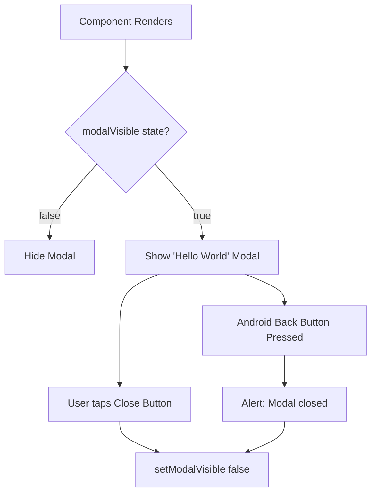

# nameList.tsx Documentation

## 1. Overview & Role
The `nameList.tsx` file appears to be a stub, placeholder, or unused experimental component left in the codebase. It renders a generic "Hello World!" modal. It does not integrate with the app's data models or theming system.

## 2. Imports & Dependencies
- `React`, `useState`: Core hooks.
- `Modal`, `View`, `Text`, `Pressable`, `Alert`, `StyleSheet` from `react-native`: Standard UI elements used to build a basic modal.

## 3. Data Structures / Interfaces
None. The component takes no props.

## 4. Deep-Dive: Methods & Functions

### `NameList` (Component)
- **Signature**: `const NameList = () =>`
- **Purpose**: Renders a basic, hardcoded modal to test modal functionality in React Native.
- **Step-by-Step Logic**:
  1. Sets up a local state variable `modalVisible` mapped to `false`.
  2. Renders a `Modal` component based on `modalVisible`.
  3. Inside the modal, renders a centered view with text "Hello World!".
  4. Includes a `Pressable` button to toggle `modalVisible` back to false.
  5. The `onRequestClose` behavior (handling Android back button) triggers an `Alert` and toggles state.
- **Error Handling**: N/A.
- **Modification Guide**: This file is likely technical debt or a sandbox file. If this was meant to list names, it needs to be updated to accept a `names: string[]` prop and render a `FlatList` of those names inside the modal view.

## 5. Code Examples
```tsx
import NameList from '../modals/nameList';

// Will render invisibly because internal state starts as false
<NameList />
```


## 6. Data Flow Diagram


