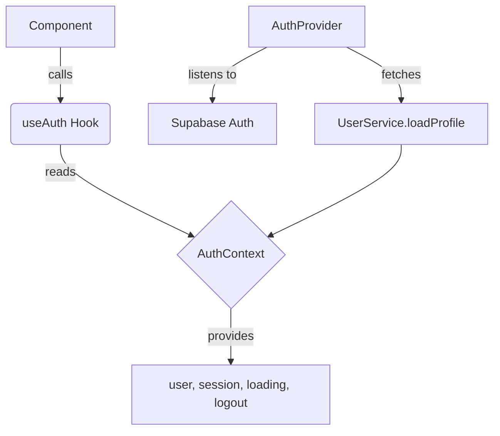

# `src/hooks/useAuth.ts`

## 1. Overview & Role
This file provides authentication state management for the entire application. It uses React's Context API to expose the current authenticated user, the Supabase session, a loading state, and a logout method to any component in the app. The `useAuth` hook is the primary way components check if a user is logged in.

## 2. Imports & Dependencies
- `React`, `createContext`, `useContext`, `useEffect`, `useState`, `ReactNode`: Core React tools to create and manage the context and state.
- `Session`: Type definition from `@supabase/supabase-js` representing the active user session.
- `supabase`: The configured database client from `../api/supabase`, used to check the session and listen to auth changes.
- `User`: TypeScript model from `../types/models` representing the user object.
- `UserService`, `createDefaultUser`: Service and helper from `../services/UserService` used to fetch or create a user's profile in the database.
- `CrashLogger`: Utility from `../services/LoggingService` for error reporting.

## 3. Data Structures / Interfaces
### `AuthContextType`
Defines the shape of the data provided by the AuthContext.
- `user`: `User | null` - The detailed profile of the currently logged-in user.
- `session`: `Session | null` - The raw Supabase session data containing access tokens.
- `loading`: `boolean` - Indicates if the auth state or user profile is currently being loaded.
- `logout`: `() => Promise<void>` - Function to sign the user out.

## 4. Deep-Dive: Methods & Functions

### `AuthProvider` Component
- **Signature**: `export const AuthProvider = ({ children }: { children: ReactNode })`
- **Purpose**: Wraps the application to provide auth context to all child components.
- **Step-by-Step Logic**:
  1. Initializes `user`, `session`, and `loading` states using `useState`.
  2. Runs a `useEffect` on mount to fetch the initial session using `supabase.auth.getSession()`.
  3. If an initial session exists, it calls `loadProfile`. If not, it sets `loading` to `false`.
  4. Sets up a listener using `supabase.auth.onAuthStateChange` to detect logins/logouts.
  5. If the session changes to valid, it calls `loadProfile`. If the session becomes null (logout), it clears the `user` state and stops loading.
  6. Returns `unsubscribe` from the effect to clean up the listener when the component unmounts.
  7. Renders the `AuthContext.Provider` with the context value.
- **Error Handling**: `useEffect` runs asynchronously, but inner functions handle their own errors (see `loadProfile`).
- **Modification Guide**: To expose an additional piece of state (e.g., `isGuestMode`), you would add it to `AuthContextType`, initialize it with a `useState` inside `AuthProvider`, and pass it down in the `value` prop.

### `loadProfile`
- **Signature**: `const loadProfile = async (uid: string, email: string)`
- **Purpose**: Fetches the user profile from the database based on the Supabase ID. Creates a new profile if one doesn't exist.
- **Step-by-Step Logic**:
  1. Sets `loading` to `true`.
  2. Calls `UserService.getUserProfile(uid)` to fetch the user from the database.
  3. If no profile is returned, calls `createDefaultUser(uid, email)` and then `UserService.createUserProfile(profile)` to save it to the DB.
  4. Updates the local `user` state with the resulting profile.
  5. In a `finally` block, sets `loading` to `false`.
- **Error Handling**: Uses a `try...catch` block. On failure, logs the error using `CrashLogger.error` and sets `user` to `null`.
- **Modification Guide**: If you want to load additional related data (like a list of user settings) during login, you can fetch it here before setting `loading` back to `false`.

### `logout`
- **Signature**: `const logout = async () => Promise<void>`
- **Purpose**: Signs the user out of the application.
- **Step-by-Step Logic**:
  1. Awaits the resolution of `supabase.auth.signOut()`.
- **Error Handling**: Does not catch errors internally. If the sign out fails, the error will bubble up to the caller.
- **Modification Guide**: To clear local cache or storage upon logout, add those clear functions here before or after the Supabase sign out call.

### `useAuth`
- **Signature**: `export const useAuth = () => AuthContextType`
- **Purpose**: Custom hook that makes it easy to consume the AuthContext.
- **Step-by-Step Logic**:
  1. Calls `useContext(AuthContext)`.
  2. If the context is undefined, throws an error warning that it must be used within an `AuthProvider`.
  3. Returns the context value.
- **Error Handling**: Throws a runtime error if used outside of `AuthProvider` to prevent silent failures.
- **Modification Guide**: No need to modify this unless you rename the context.

## 5. Code Examples
```tsx
import { useAuth } from '../hooks/useAuth';

const ProfileScreen = () => {
  const { user, logout, loading } = useAuth();

  if (loading) return <Text>Loading...</Text>;
  
  return (
    <View>
      <Text>Welcome, {user?.name}</Text>
      <Button title="Sign Out" onPress={logout} />
    </View>
  );
};
```

## 6. Data Flow Diagram

