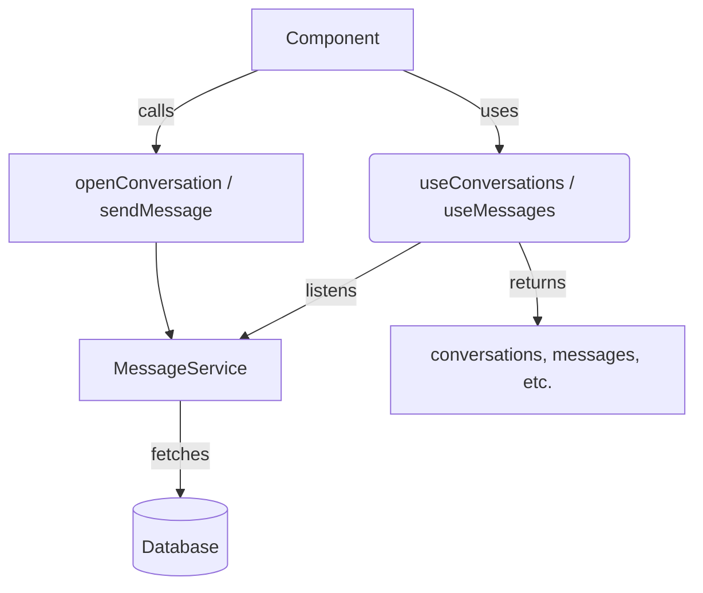

# `src/hooks/useConversations.ts`

## 1. Overview & Role
This file provides two custom hooks, `useConversations` and `useMessages`. They manage the state for messaging functionality, allowing components to list a user's conversations and read/send messages within a specific conversation.

## 2. Imports & Dependencies
- `useState`, `useEffect`: React hooks for managing state and side-effects.
- `Conversation`, `Message`: TypeScript models from `../types/models` describing the shape of messaging data.
- `MessageService`: Service from `../services/MessageService` that handles all database interaction.
- `CrashLogger`: Utility from `../services/LoggingService` used to handle and log errors.

## 3. Data Structures / Interfaces
No complex custom interfaces are defined in this file. It relies on the `Conversation` and `Message` models imported from `types/models`.

## 4. Deep-Dive: Methods & Functions

### `useConversations`
- **Signature**: `export const useConversations = (userId: string | undefined)`
- **Purpose**: Fetches and listens to real-time updates for all conversations involving the current user.
- **Step-by-Step Logic**:
  1. Initializes states for `conversations` (array), `loading` (boolean), and `error` (Error object).
  2. Triggers a `useEffect` whenever `userId` changes.
  3. If `userId` is missing, resets conversations to empty and stops loading.
  4. If `userId` exists, calls `MessageService.listenToConversations` to set up a real-time listener.
  5. The listener callbacks update the `conversations` state on success and `error` state on failure, while setting `loading` to `false` in both cases.
  6. Returns the cleanup function `unsubscribe` from the effect.
  7. Exposes an `openConversation` helper function (described below).
  8. Returns an object: `{ conversations, loading, error, openConversation }`.
- **Error Handling**: Errors from the listener update the local `error` state, which can be checked by the UI.
- **Modification Guide**: To add unread count tracking, you would modify the listener callback to calculate total unread messages and expose an `unreadCount` state variable from this hook.

### `openConversation` (inside `useConversations`)
- **Signature**: `const openConversation = async (otherUserId: string): Promise<string>`
- **Purpose**: Gets the ID of an existing conversation with another user, or creates a new one if it doesn't exist.
- **Step-by-Step Logic**:
  1. Checks if `userId` is available. If not, throws an error `'Not authenticated'`.
  2. Calls and returns `MessageService.getOrCreateConversation(userId, otherUserId)`.
- **Error Handling**: Throws an explicit error if the user is not authenticated. Propagates errors from the service level.
- **Modification Guide**: To also accept an initial message when opening a conversation, you would add an `initialMessage` parameter and call `sendMessage` immediately after creating the conversation.

### `useMessages`
- **Signature**: `export const useMessages = (conversationId: string | undefined)`
- **Purpose**: Fetches and listens to real-time updates for messages within a specific conversation.
- **Step-by-Step Logic**:
  1. Initializes states for `messages` (array) and `loading` (boolean).
  2. Triggers a `useEffect` whenever `conversationId` changes.
  3. If `conversationId` is missing, resets messages to empty and stops loading.
  4. Sets `loading` to true and calls `MessageService.listenToMessages` with the ID.
  5. On data received, updates `messages` state and stops loading. On error, logs to `CrashLogger` and stops loading.
  6. Returns the `unsubscribe` cleanup function.
  7. Exposes `sendMessage` (described below).
  8. Returns an object: `{ messages, loading, sendMessage }`.
- **Error Handling**: Errors from listening are logged via `CrashLogger.error`. 
- **Modification Guide**: If you want to sort messages oldest-first locally instead of relying on the DB order, you can call `.reverse()` or `.sort()` inside the success callback.

### `sendMessage` (inside `useMessages`)
- **Signature**: `const sendMessage = async (senderId: string, content: string)`
- **Purpose**: Sends a new message to the active conversation.
- **Step-by-Step Logic**:
  1. Validates that `conversationId` exists and that `content` isn't just whitespace. Returns early if invalid.
  2. Awaits `MessageService.sendMessage(conversationId, senderId, content)`.
- **Error Handling**: Wrapped in a `try...catch`. Catches errors, logs them using `CrashLogger.error`, and re-throws them so the caller can display a UI error if needed.
- **Modification Guide**: To support image messages, you would add an optional `imageUrl` parameter to this function and pass it down to `MessageService.sendMessage`.

## 5. Code Examples
```tsx
import { useConversations } from '../hooks/useConversations';

const InboxScreen = ({ userId }) => {
  const { conversations, loading, openConversation } = useConversations(userId);

  if (loading) return <Text>Loading Inbox...</Text>;

  return (
    <FlatList
      data={conversations}
      renderItem={({ item }) => (
        <Text onPress={() => openConversation(item.otherParticipantId)}>
          Chat with {item.otherParticipantName}
        </Text>
      )}
    />
  );
};
```

## 6. Data Flow Diagram

