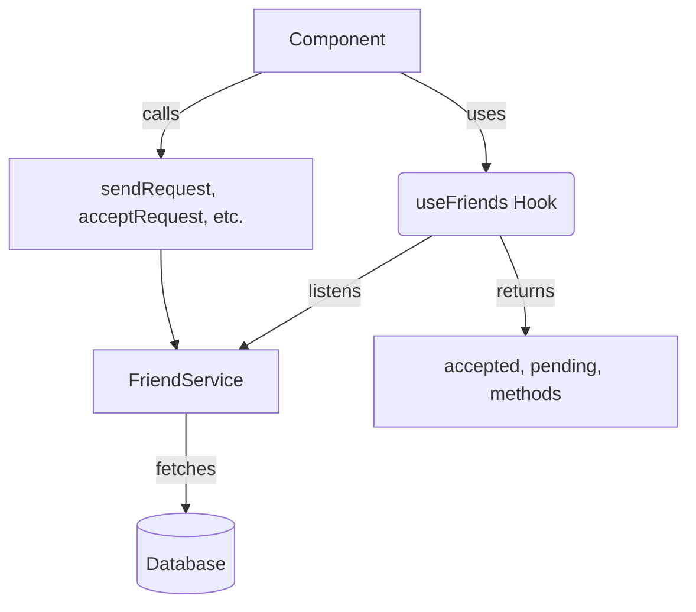

# `src/hooks/useFriends.ts`

## 1. Overview & Role
This file provides the `useFriends` custom hook, which handles all state and logic related to a user's friends list. It manages fetching the list of friends in real-time, categorized into "accepted" and "pending", and provides methods to send, accept, decline, or remove friend requests.

## 2. Imports & Dependencies
- `useState`, `useEffect`: React hooks for state and side-effects.
- `Friend`: TypeScript model from `../types/models` describing a friend relationship.
- `FriendService`: Service from `../services/FriendService` handling database operations.
- `CrashLogger`: Utility from `../services/LoggingService` for error reporting.

## 3. Data Structures / Interfaces
No custom interfaces; utilizes the `Friend` type from `types/models`.

## 4. Deep-Dive: Methods & Functions

### `useFriends`
- **Signature**: `export const useFriends = (userId: string | undefined)`
- **Purpose**: Connects to the database to sync the user's friend list and exposes actionable methods.
- **Step-by-Step Logic**:
  1. Initializes `friends` (array), `loading` (boolean), and `error` (Error object) state variables.
  2. Runs a `useEffect` block when `userId` changes.
  3. If no `userId`, resets the friend list and stops loading.
  4. If `userId` exists, sets loading to true and calls `FriendService.listenToFriends` to establish a real-time subscription.
  5. The success callback updates `friends` and stops loading. The error callback updates `error` and stops loading.
  6. Filters the full `friends` list into `accepted` (where status === 'accepted') and `pending` (where status === 'pending').
  7. Exposes several helper methods to manipulate the list (detailed below).
  8. Returns all state properties and functions.
- **Error Handling**: Real-time listener errors are stored in the local `error` state.
- **Modification Guide**: To also track "blocked" users, you would add a new variable `const blocked = friends.filter(f => f.status === 'blocked');` and expose it in the return object.

### `sendRequest` (inside `useFriends`)
- **Signature**: `const sendRequest = async (targetUserId: string)`
- **Purpose**: Initiates a new friend request.
- **Step-by-Step Logic**:
  1. Exits early if `userId` is undefined.
  2. Calls `FriendService.sendRequest(userId, targetUserId)`.
- **Error Handling**: Uses a `try...catch` block. Logs errors via `CrashLogger` and re-throws them.
- **Modification Guide**: To prevent sending a request if they are already friends, you can add a check `if (friends.some(f => f.friendId === targetUserId)) return;` before calling the service.

### `acceptRequest` (inside `useFriends`)
- **Signature**: `const acceptRequest = async (friendRowId: string)`
- **Purpose**: Accepts a pending friend request.
- **Step-by-Step Logic**:
  1. Calls `FriendService.acceptRequest(friendRowId)`.
- **Error Handling**: Wraps the call in `try...catch`. Logs to `CrashLogger` and re-throws.
- **Modification Guide**: N/A, simply delegates to the service.

### `declineRequest` (inside `useFriends`)
- **Signature**: `const declineRequest = async (friendRowId: string)`
- **Purpose**: Declines a pending friend request.
- **Step-by-Step Logic**:
  1. Calls `FriendService.declineRequest(friendRowId)`.
- **Error Handling**: Wraps the call in `try...catch`. Logs to `CrashLogger` and re-throws.
- **Modification Guide**: N/A, simply delegates to the service.

### `removeFriend` (inside `useFriends`)
- **Signature**: `const removeFriend = async (friendRowId: string)`
- **Purpose**: Removes an accepted friend from the list.
- **Step-by-Step Logic**:
  1. Calls `FriendService.removeFriend(friendRowId)`.
- **Error Handling**: Wraps the call in `try...catch`. Logs to `CrashLogger` and re-throws.
- **Modification Guide**: N/A, simply delegates to the service.

## 5. Code Examples
```tsx
import { useFriends } from '../hooks/useFriends';

const FriendsScreen = ({ userId }) => {
  const { accepted, pending, loading, acceptRequest, removeFriend } = useFriends(userId);

  if (loading) return <Text>Loading friends...</Text>;

  return (
    <View>
      <Text>Pending Requests: {pending.length}</Text>
      {pending.map(f => (
        <Button key={f.id} title="Accept" onPress={() => acceptRequest(f.id)} />
      ))}
      
      <Text>My Friends: {accepted.length}</Text>
      {accepted.map(f => (
        <Button key={f.id} title="Remove" onPress={() => removeFriend(f.id)} />
      ))}
    </View>
  );
};
```

## 6. Data Flow Diagram

