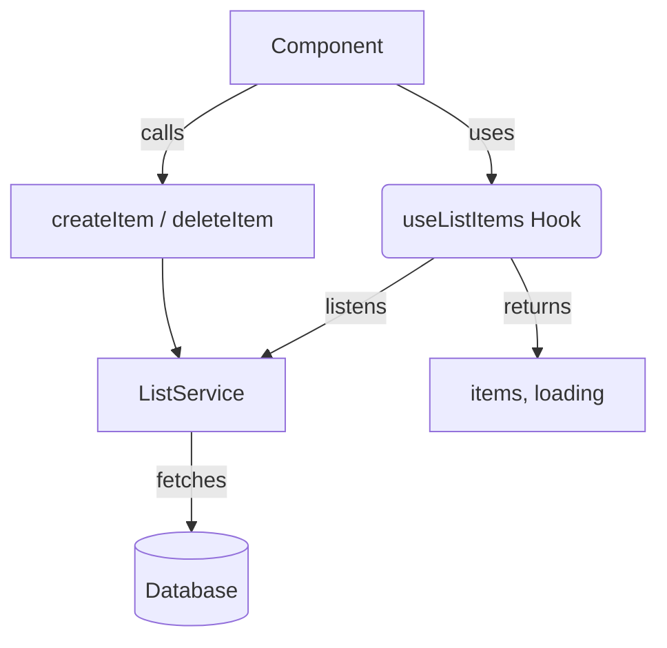

# `src/hooks/useListItems.ts`

## 1. Overview & Role
This hook is primarily for managing the basic state and actions of items within a gift list, without concerning itself with complex "claim" logic (which is handled by `useListDetail`). It provides functions to add and delete individual gift items.

## 2. Imports & Dependencies
- `useState`, `useEffect`: Standard React state management.
- `ListService`: Service from `../services/ListService` for DB operations.
- `GiftItem`: The data model from `../types/models`.

## 3. Data Structures / Interfaces
No custom interfaces created, uses `GiftItem`.

## 4. Deep-Dive: Methods & Functions

### `useListItems`
- **Signature**: `export const useListItems = (listId: string, userId: string | undefined)`
- **Purpose**: Subscribes to the real-time list of items in a specific list, and provides basic CRUD (Create, Read, Update, Delete) methods.
- **Step-by-Step Logic**:
  1. Initializes `items`, `loading`, and `error` state variables.
  2. Runs `useEffect` when `userId` or `listId` changes.
  3. If no `userId`, resets `items` and stops loading.
  4. Sets `loading` to true, clears any previous `error`.
  5. Calls `ListService.listenToItems`. Updates `items` state on success and `error` state on failure. Stops loading in both cases.
  6. Returns the `unsubscribe` cleanup function.
  7. Exposes helper functions (detailed below).
- **Error Handling**: Real-time listener errors are stored in local `error` state.
- **Modification Guide**: To filter out items that are marked as 'hidden', you could modify the success callback to `setItems(newItems.filter(item => !item.isHidden))`.

### `fetchItems` (inside `useListItems`)
- **Signature**: `const fetchItems = async () => {}`
- **Purpose**: An empty dummy function kept for backward API compatibility, as real-time subscriptions have replaced manual fetching.
- **Step-by-Step Logic**: Does nothing.

### `createItem` (inside `useListItems`)
- **Signature**: `const createItem = async (listId: string, item: GiftItem)`
- **Purpose**: Adds a new item to the database.
- **Step-by-Step Logic**:
  1. Validates `userId` exists, throwing an error if missing.
  2. Awaits and returns the result of `ListService.addItem(listId, item)`.
- **Error Handling**: Unhandled exceptions will propagate to the caller.
- **Modification Guide**: To automatically prepend a default note, you could modify the `item` object before passing it to the service: `item.notes = item.notes || "No notes provided";`.

### `deleteItem` (inside `useListItems`)
- **Signature**: `const deleteItem = async (listId: string, itemId: string): Promise<void>`
- **Purpose**: Deletes an item from the list.
- **Step-by-Step Logic**:
  1. Awaits and returns the result of `ListService.deleteItem(listId, itemId)`.
- **Error Handling**: Propagates errors to caller.
- **Modification Guide**: Delegates directly to service.

## 5. Code Examples
```tsx
import { useListItems } from '../hooks/useListItems';

const EditListScreen = ({ listId, userId }) => {
  const { items, loading, deleteItem } = useListItems(listId, userId);

  if (loading) return <Text>Loading...</Text>;

  return (
    <FlatList
      data={items}
      renderItem={({ item }) => (
        <View>
          <Text>{item.name}</Text>
          <Button title="Delete" onPress={() => deleteItem(listId, item.id)} />
        </View>
      )}
    />
  );
};
```

## 6. Data Flow Diagram

