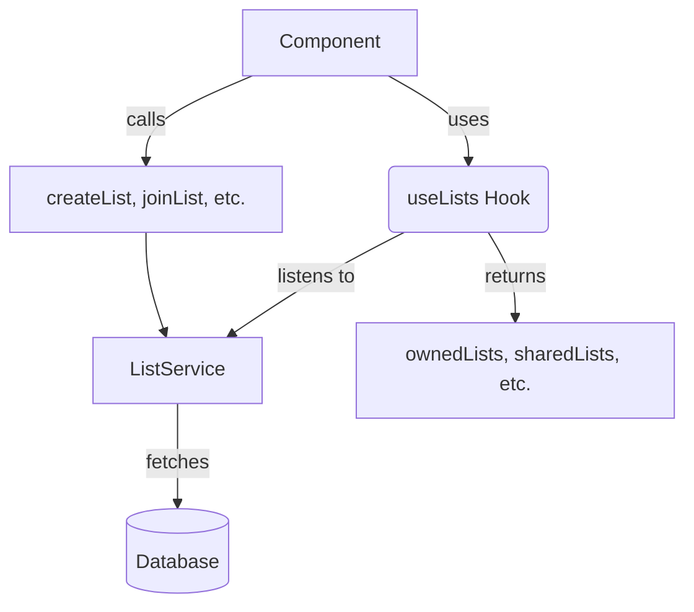

# `src/hooks/useLists.ts`

## 1. Overview & Role
This file provides the `useLists` custom hook. It manages retrieving and acting on the top-level gift lists that belong to a user, separated into "owned lists" (created by the user) and "shared lists" (lists the user has joined). 

## 2. Imports & Dependencies
- `useState`, `useEffect`: React hooks for tracking list states and data fetching.
- `GiftList`: TypeScript model from `../types/models` describing a single list's properties.
- `ListService`, `CreateListResult`: Service and type from `../services/ListService` for DB transactions.

## 3. Data Structures / Interfaces
No custom interfaces created in this file, utilizes `GiftList` and `CreateListResult`.

## 4. Deep-Dive: Methods & Functions

### `useLists`
- **Signature**: `export const useLists = (userId: string | undefined)`
- **Purpose**: Sets up dual listeners for owned and shared lists, combining their loading states into a single unified boolean.
- **Step-by-Step Logic**:
  1. Initializes `ownedLists` (array), `sharedLists` (array), `loading` (boolean), and `error` (Error).
  2. Runs `useEffect` when `userId` changes. If no ID, resets everything and stops loading.
  3. Sets `loading` to `true` and creates two local tracking booleans: `ownedReady` and `sharedReady`.
  4. Defines a `checkDone` function that sets `loading` to `false` only if both `ownedReady` and `sharedReady` are true.
  5. Calls `ListService.listenToOwnedLists`. On success/error, it updates the state, sets `ownedReady = true`, and calls `checkDone()`.
  6. Calls `ListService.listenToSharedLists`. On success/error, it updates the state, sets `sharedReady = true`, and calls `checkDone()`.
  7. Returns the cleanup function which calls both `unsubOwned` and `unsubShared`.
  8. Exposes methods for creating, joining, and deleting lists (detailed below).
- **Error Handling**: Real-time listener errors are stored in the `error` state.
- **Modification Guide**: To merge these lists into one big array, you could add `const allLists = [...ownedLists, ...sharedLists]` and export `allLists` from the hook.

### `createList` (inside `useLists`)
- **Signature**: `const createList = async (name: string, isSharable: boolean): Promise<CreateListResult>`
- **Purpose**: Creates a new gift list owned by the user.
- **Step-by-Step Logic**:
  1. Throws an error immediately if `userId` is missing.
  2. Awaits and returns the result of `ListService.createList(userId, name, isSharable)`.
- **Error Handling**: Throws standard errors if unauthenticated or if the service call fails.
- **Modification Guide**: If you want a default list color, you could pass it directly in the service call: `ListService.createList(userId, name, isSharable, '#FF0000')` assuming the service supports it.

### `deleteList` (inside `useLists`)
- **Signature**: `const deleteList = async (listId: string): Promise<void>`
- **Purpose**: Deletes an existing gift list.
- **Step-by-Step Logic**:
  1. Calls `ListService.deleteList(listId)`.
- **Error Handling**: Errors bubble up to the caller.
- **Modification Guide**: Delegates to service.

### `joinList` (inside `useLists`)
- **Signature**: `const joinList = async (shareCode: string): Promise<void>`
- **Purpose**: Uses a secret share code to gain access to someone else's shared list.
- **Step-by-Step Logic**:
  1. Calls `ListService.joinListByCode(shareCode)`.
- **Error Handling**: Errors bubble up to the caller.
- **Modification Guide**: Delegates to service.

### `fetchLists` (inside `useLists`)
- **Signature**: `const fetchLists = async () => {}`
- **Purpose**: An empty dummy function kept for backward API compatibility with components like `DashboardScreen` that might still expect to call a manual fetch method, even though the data is now real-time.
- **Step-by-Step Logic**: Does nothing.

## 5. Code Examples
```tsx
import { useLists } from '../hooks/useLists';

const Dashboard = ({ userId }) => {
  const { ownedLists, loading, createList } = useLists(userId);

  if (loading) return <Text>Loading lists...</Text>;

  return (
    <View>
      <Text>My Lists</Text>
      {ownedLists.map(list => (
        <Text key={list.id}>{list.name}</Text>
      ))}
      <Button 
        title="Create List" 
        onPress={() => createList("Birthday Gifts", true)} 
      />
    </View>
  );
};
```

## 6. Data Flow Diagram

