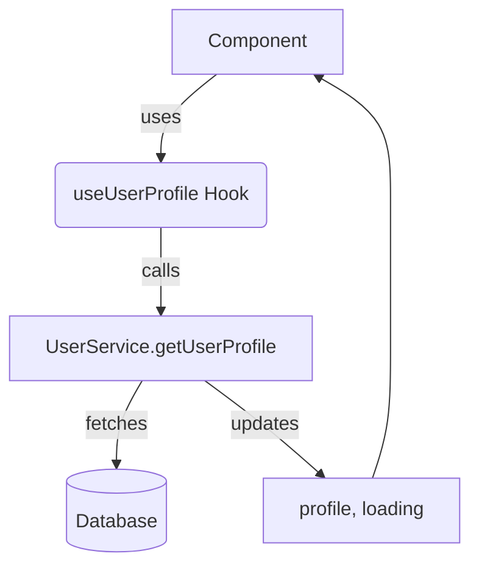

# `src/hooks/useUserProfile.ts`

## 1. Overview & Role
This custom hook acts as a dedicated fetcher for user profile information. Given a User ID (`uid`), it attempts to fetch the corresponding full profile document from the database. It is useful when you have a User ID (like from a chat message or friend request) and need to display their name and avatar.

## 2. Imports & Dependencies
- `useState`, `useEffect`: Standard React state hooks.
- `User`: The user model from `../types/models`.
- `UserService`: Service from `../services/UserService` which executes the DB query.
- `CrashLogger`: Service from `../services/LoggingService` for logging errors.

## 3. Data Structures / Interfaces
### `UseUserProfileResult`
- `profile`: `User | null` - The retrieved user data, or null if loading/failed.
- `loading`: `boolean` - Indicates whether the request is actively fetching.

## 4. Deep-Dive: Methods & Functions

### `useUserProfile`
- **Signature**: `export const useUserProfile = (uid: string | null): UseUserProfileResult`
- **Purpose**: Fetches a single user profile asynchronously based on a UID. Prevents state updates on unmounted components using a cancellation flag.
- **Step-by-Step Logic**:
  1. Initializes `profile` to null and `loading` to true.
  2. Triggers `useEffect` when `uid` changes.
  3. If `uid` is null, sets profile to null and loading to false. Returns early.
  4. Sets a local `cancelled` flag to `false`. This prevents memory leaks if the component unmounts before the network request finishes.
  5. Defines an inner async function `fetchProfile`:
     - Sets `loading` to true.
     - Calls `UserService.getUserProfile(uid)`.
     - If the network call succeeds and `!cancelled`, updates `profile` state.
     - In the `catch` block, logs the error via `CrashLogger.error(error)`.
     - In the `finally` block, sets `loading` to false if `!cancelled`.
  6. Invokes `fetchProfile()`.
  7. Returns a cleanup function from the `useEffect` that sets `cancelled = true`.
- **Error Handling**: Uses standard `try...catch...finally` block. Failing to fetch a user gracefully swallows the error (leaving profile null) and logs the failure to CrashLogger.
- **Modification Guide**: To also return an `error` state, you would add an `error` boolean to the state, update it in the `catch` block, and return it alongside `profile` and `loading`.

## 5. Code Examples
```tsx
import { useUserProfile } from '../hooks/useUserProfile';

const AvatarComponent = ({ userId }) => {
  const { profile, loading } = useUserProfile(userId);

  if (loading) return <Text>...</Text>;
  if (!profile) return <Text>Unknown User</Text>;

  return <Image source={{ uri: profile.avatarUrl }} alt={profile.name} />;
};
```

## 6. Data Flow Diagram

