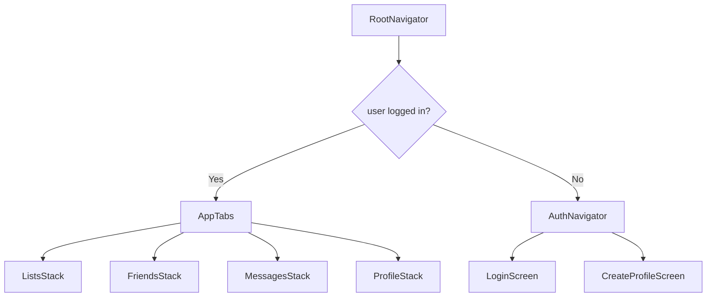

# `src/navigation/AppNavigator.tsx`

## 1. Overview & Role
This file is the "traffic controller" for the entire React Native application. It defines the routing structure using React Navigation. It decides whether the user should see the login screens (if unauthenticated) or the main app tabs (if authenticated). It configures the bottom tab bar and the various stack navigators for different sections of the app.

## 2. Imports & Dependencies
- `React`: Required for JSX and React components.
- `createStackNavigator` from `@react-navigation/stack`: Used to create a stack of screens where a new screen is placed on top of the old one (like a stack of cards).
- `createBottomTabNavigator` from `@react-navigation/bottom-tabs`: Used to create the bottom navigation bar with icons.
- `NavigationContainer`, `DefaultTheme`, `DarkTheme` from `@react-navigation/native`: The root component that manages the navigation tree and state, along with built-in themes.
- React Native components (`ActivityIndicator`, `View`, `StyleSheet`): Used for rendering a loading spinner while checking auth state.
- `FontAwesome5` from `@expo/vector-icons`: Used for rendering icons in the bottom tab bar.
- `useAuth`: Custom hook to check if the user is currently logged in.
- `useAppTheme`: Custom hook to get the current color palette (light/dark mode).
- Various Screen components (`LoginScreen`, `DashboardScreen`, etc.): The actual UI views being routed to.

## 3. Data Structures / Interfaces

### `AuthStackParamList`, `AppStackParamList`, `TabParamList`
**Description**: These types define the exact strings that represent screen routes, and what properties each route expects.
- `AuthStackParamList`: Contains `Login` and `CreateProfile` (both `undefined` meaning no props).
- `AppStackParamList`: Contains the deeply nested screens like `ListDetail` (needs `listId`, `ownerId`), `Conversation` (needs `conversationId`).
- `TabParamList`: Defines the bottom tab routes (`ListsTab`, `FriendsTab`, etc.).

## 4. Deep-Dive: Methods & Functions

### `AuthNavigator()`
- **Signature**: `const AuthNavigator = () => JSX.Element`
- **Purpose**: Returns the stack of screens for users who are not logged in.
- **Step-by-Step Logic**:
  1. Creates an `<AuthStack.Navigator>` with `headerShown: false` so the top header doesn't show by default.
  2. Defines the `Login` screen.
  3. Defines the `CreateProfile` screen, overriding options to show a header with the title 'Create Account'.
- **Modification Guide**: To add a "Forgot Password" screen, import it, add `ForgotPassword: undefined` to `AuthStackParamList`, and add `<AuthStack.Screen name="ForgotPassword" component={ForgotPasswordScreen} />` here.

### Stack Navigators (`ListsStack`, `FriendsStack`, `MessagesStack`, `ProfileStack`)
- **Signature**: `const [Name]Stack = () => JSX.Element`
- **Purpose**: Each creates a nested Stack navigator for one of the tabs. For example, `ListsStack` holds `Dashboard`, `ListDetail`, `AddItem`, and `ListEdit`.
- **Modification Guide**: If you create a new screen for editing a specific item on a list (e.g., `ItemEditScreen`), you would add it inside `ListsStack` as `<AppStack.Screen name="ItemEdit" component={ItemEditScreen} />`.

### `AppTabs()`
- **Signature**: `const AppTabs = () => JSX.Element`
- **Purpose**: Renders the Bottom Tab navigator.
- **Step-by-Step Logic**:
  1. Calls `useAppTheme()` to get the current app `colors`.
  2. Returns a `<Tab.Navigator>`.
  3. Uses `screenOptions` to dynamically style the tab bar:
     - Sets active and inactive colors based on the theme.
     - Defines `tabBarIcon` dynamically: it maps the `route.name` to a specific `FontAwesome5` icon string (`gift`, `user-friends`, `comment-alt`, `user`).
     - Hides the default header.
  4. Renders `<Tab.Screen>` for each tab, assigning the corresponding Stack navigator component (e.g., `component={ListsStack}`).
- **Modification Guide**: To add a new tab (e.g., "Settings"), add `SettingsTab: undefined` to `TabParamList`, create a `SettingsStack`, map an icon string in `icons`, and add `<Tab.Screen name="SettingsTab" component={SettingsStack} />`.

### `RootNavigator()`
- **Signature**: `export const RootNavigator = () => JSX.Element`
- **Purpose**: The absolute top-level navigation component. It decides between `AppTabs` and `AuthNavigator`.
- **Step-by-Step Logic**:
  1. Calls `useAuth()` to get `user` and `loading` status.
  2. Calls `useAppTheme()` to get `isDark` and `colors`.
  3. **Check Loading**: If `loading` is true, returns a `View` with an `ActivityIndicator` (loading spinner).
  4. **Create navTheme**: Merges React Navigation's default themes with our custom theme colors so that built-in headers and backgrounds match our UI.
  5. **Return**: Renders `<NavigationContainer>` wrapping a conditional statement: if `user` exists, render `<AppTabs />`, else render `<AuthNavigator />`.
- **Modification Guide**: If you want to add an introductory onboarding flow that only runs once, you would check a flag here (e.g., `hasSeenOnboarding`) and return an `<OnboardingNavigator />` instead of `<AuthNavigator />`.

## 5. Code Examples
*(RootNavigator is typically used once in `App.tsx` or `index.ts`)*
```tsx
import { RootNavigator } from './src/navigation/AppNavigator';

export default function App() {
  return (
    <ThemeProvider>
      <AuthProvider>
        <RootNavigator />
      </AuthProvider>
    </ThemeProvider>
  );
}
```

## 6. Data Flow Diagram

