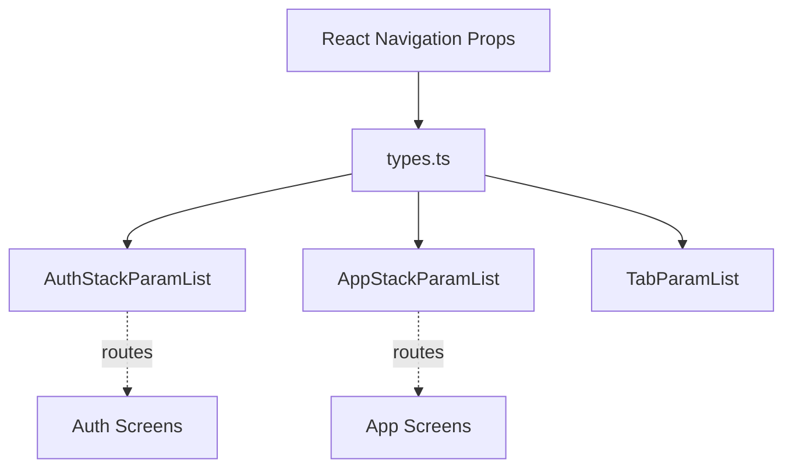

# `src/navigation/types.ts`

## 1. Overview & Role
This file is the single source of truth for **TypeScript definitions** related to app navigation. It defines exactly what screens exist in the app and what parameters (props or data) they expect when navigating. By centralizing these types, we prevent bugs where a screen is called with missing or incorrect data.

## 2. Imports & Dependencies
- `StackNavigationProp` from `@react-navigation/stack`: Provides the TypeScript type for the `navigation` object injected into components in a stack navigator. This allows us to have autocomplete for methods like `navigation.navigate('ScreenName')`.
- `RouteProp` from `@react-navigation/native`: Provides the TypeScript type for the `route` object injected into components. This contains the parameters passed to the screen (e.g., `route.params.listId`).

## 3. Data Structures / Interfaces

### `AuthStackParamList`
**Description**: Defines the screens and parameters for the "unauthenticated" state of the app (when the user is not logged in).
**Type Definition**:
```typescript
export type AuthStackParamList = {
  Login: undefined;
  Register: undefined; // Optional if you split them later
};
```
- `Login`: Takes `undefined` because navigating to the Login screen does not require passing any parameters.
- `Register`: Takes `undefined` for the same reason.

### `AppStackParamList`
**Description**: Defines the screens and parameters for the "authenticated" state of the app (when the user is logged in).
**Type Definition**:
```typescript
export type AppStackParamList = {
  Dashboard: undefined;
  ListDetail: { 
    listId: string; 
    ownerId: string; 
    title?: string;
  };
  AddItem: { 
    listId: string; 
  };
};
```
- `Dashboard`: Takes no parameters (`undefined`).
- `ListDetail`: Requires a `listId` and an `ownerId` to load the list details and determine permissions. It optionally takes a `title` to display in the header immediately before data loads.
- `AddItem`: Requires a `listId` so the screen knows which list to add a new item to.

### Helper Types for Screens

#### `AppNavProps<T>`
**Description**: A generic helper type to easily type the props for any screen in the `AppStackParamList`.
**Type Definition**:
```typescript
export type AppNavProps<T extends keyof AppStackParamList> = {
  navigation: StackNavigationProp<AppStackParamList, T>;
  route: RouteProp<AppStackParamList, T>;
};
```
**Modification Guide**: If you want a screen like `Dashboard` to be properly typed, use `export const DashboardScreen = ({ navigation, route }: AppNavProps<'Dashboard'>) => { ... }`.

#### `AuthNavProps<T>`
**Description**: A generic helper type to easily type the props for any screen in the `AuthStackParamList`.
**Type Definition**:
```typescript
export type AuthNavProps<T extends keyof AuthStackParamList> = {
  navigation: StackNavigationProp<AuthStackParamList, T>;
  route: RouteProp<AuthStackParamList, T>;
};
```

## 4. Deep-Dive: Methods & Functions
*(No runtime methods or functions in this file. It contains purely TypeScript definitions that compile away during runtime.)*

## 5. Code Examples

**Typing a screen correctly:**
```tsx
import { AppNavProps } from '../navigation/types';

export const AddItemScreen = ({ navigation, route }: AppNavProps<'AddItem'>) => {
  // route.params will automatically know it has `listId` as a string!
  const { listId } = route.params;

  return <View>...</View>;
};
```

**Typing a generic navigation prop (when not inside a Screen component):**
```tsx
import { StackNavigationProp } from '@react-navigation/stack';
import { AppStackParamList } from '../navigation/types';

// For a nested button component navigating to ListDetail
const navigateToList = (nav: StackNavigationProp<AppStackParamList, 'Dashboard'>, id: string) => {
    nav.navigate('ListDetail', { listId: id, ownerId: '123' }); 
    // TypeScript will error if you omit ownerId!
}
```

## 6. Data Flow Diagram

