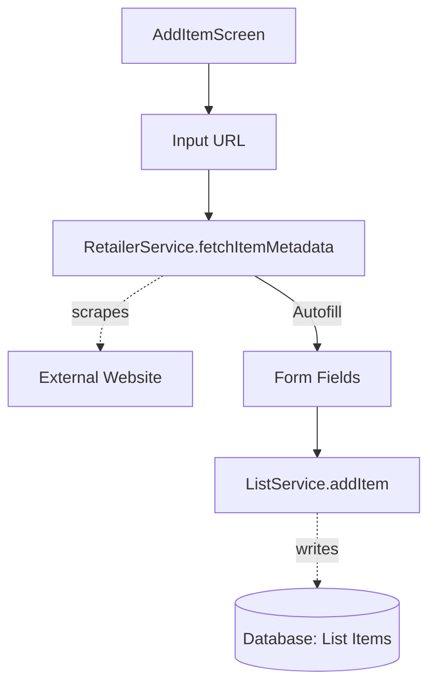

# `src/screens/AddItemScreen.tsx`

## 1. Overview & Role
The `AddItemScreen` is a form that allows the owner of a list to add a new gift to it. It features a unique auto-fill capability: if the user pastes a URL to a product, the app uses a scraping service to attempt to automatically fill in the name, price, and description.

## 2. Imports & Dependencies
- `React`, `useState`, `useEffect`: React hooks for form state.
- React Native components (`View`, `Text`, `TextInput`, `TouchableOpacity`, `Switch`, `Image`, etc.): UI building blocks.
- `useNavigation`, `useRoute`: Navigation hooks.
- `ListService`: For saving the new item to the database.
- `RetailerService` (`../services/RetailerService`): Contains `fetchItemMetadata(url)` which calls a cloud function to scrape HTML metadata.
- `* as ImagePicker` from `expo-image-picker`: Allows the user to select a photo from their camera roll.
- `KeyboardAwareScrollView`: For form scrollability.
- `CrashLogger`, `useAppTheme`, `useAuth`: Standard app utilities.

## 3. Data Structures / Interfaces
### `AddItemRouteProp`
**Definition**: `type AddItemRouteProp = RouteProp<AppStackParamList, 'AddItem'>;`
**Purpose**: Typed route to access `listId`.

## 4. Deep-Dive: Methods & Functions

### `handlePickImage()`
- **Signature**: `const handlePickImage = async () => Promise<void>`
- **Purpose**: Opens the native iOS/Android photo library to select an image for the gift.
- **Step-by-Step Logic**:
  1. Calls `ImagePicker.requestMediaLibraryPermissionsAsync()`.
  2. If denied, shows an alert and exits.
  3. Calls `ImagePicker.launchImageLibraryAsync()` with options to allow cropping to a 4:3 aspect ratio.
  4. If the user doesn't cancel, saves the local URI to the `imageUri` state so it can be previewed.
  *(Note: Currently, the URI is selected but the upload logic to Supabase storage seems to be missing in `handleAdd`, this is a good spot for a beginner to add functionality!)*

### `handleUrlBlur()`
- **Signature**: `const handleUrlBlur = async () => Promise<void>`
- **Purpose**: Triggers automatically when the user taps away (blurs) from the URL input field.
- **Step-by-Step Logic**:
  1. Ignores empty or very short URLs.
  2. Sets `scraping` to `true` (shows a spinner next to the input).
  3. Awaits `RetailerService.fetchItemMetadata(url)`.
  4. If metadata is found, automatically updates the `name`, `price`, and `description` state variables.
  5. If an error occurs, catches it, logs it, and alerts the user to enter data manually.

### `handleAdd()`
- **Signature**: `const handleAdd = async () => Promise<void>`
- **Purpose**: Submits the final form to create the item.
- **Step-by-Step Logic**:
  1. Validates that `name` is provided.
  2. Sets `submitting` to `true`.
  3. Calls `ListService.addItem` passing the `listId`, `user.uid`, and the constructed item object. `price` is parsed from string to float.
  4. If successful, calls `navigation.goBack()` to return to the List Detail screen.
- **Modification Guide**: To actually upload the `imageUri`, you would need to add code here to call `SupabaseStorageService.upload(imageUri)` and pass the resulting public URL into the `ListService.addItem` payload.

## 5. Code Examples
N/A - Routed via React Navigation.

## 6. Data Flow Diagram

