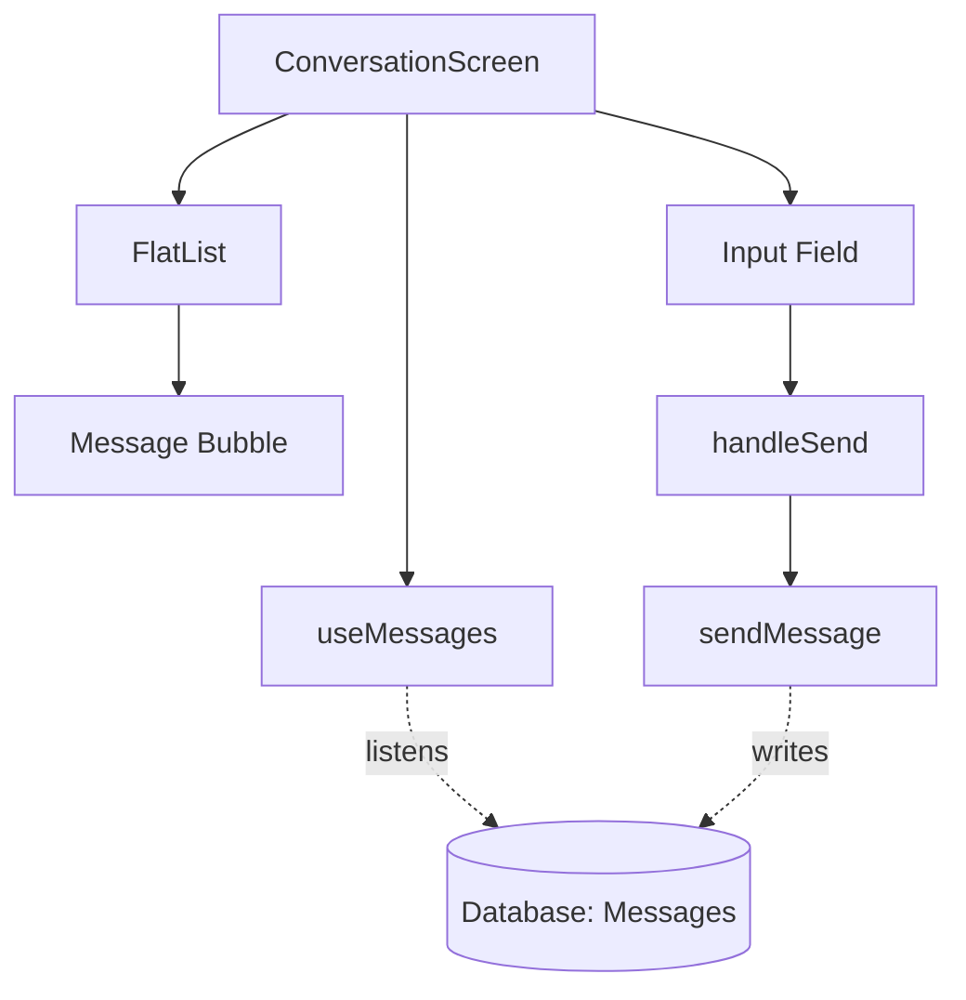

# `src/screens/ConversationScreen.tsx`

## 1. Overview & Role
The `ConversationScreen` provides the actual chat interface for direct messages between two users. It displays a scrollable list of messages (bubbles) and a text input at the bottom to send new messages.

## 2. Imports & Dependencies
- `React`, `useState`, `useRef`, `useEffect`: React hooks for state, references (scrolling), and side effects.
- React Native components (`View`, `Text`, `TextInput`, `TouchableOpacity`, `FlatList`, `StyleSheet`, `KeyboardAvoidingView`, `Platform`, `ActivityIndicator`): UI components. `KeyboardAvoidingView` is specifically used so the chat list and text input slide up when the keyboard opens.
- `FontAwesome5`: For the send paper-plane icon.
- `StackScreenProps` from `@react-navigation/stack`: Extracts TypeScript props.
- `AppStackParamList` (`../navigation/AppNavigator`): Defines the routes.
- `useAuth` (`../hooks/useAuth`): Gets the current user ID to determine which messages are "Me" vs "Them".
- `useMessages` (`../hooks/useConversations`): Fetches the real-time message list for this specific conversation and provides the `sendMessage` function.
- `useAppTheme`: Theming context.
- `Message`: TypeScript model.

## 3. Data Structures / Interfaces
### `Props`
**Definition**: `type Props = StackScreenProps<AppStackParamList, 'Conversation'>;`
**Purpose**: Explicitly types this screen's props so TypeScript knows `route.params` contains a `conversationId`.

## 4. Deep-Dive: Methods & Functions

### `ConversationScreen({ route })`
- **Signature**: `export const ConversationScreen = ({ route }: Props) => JSX.Element`
- **Purpose**: Main functional component. Extracts `conversationId` from `route.params`.

### Scroll-to-Bottom `useEffect`
- **Signature**: `useEffect(() => { ... }, [messages.length])`
- **Purpose**: Automatically scrolls the chat to the newest message when the list loads or a new message arrives.
- **Step-by-Step Logic**:
  1. Checks if the `messages` array has items.
  2. If true, accesses the `listRef.current` (which points to the `FlatList`) and calls `.scrollToEnd({ animated: true })`.

### `handleSend()`
- **Signature**: `const handleSend = async () => Promise<void>`
- **Purpose**: Triggers when the user presses the send icon.
- **Step-by-Step Logic**:
  1. Validates `draft` (trims whitespace) and ensures `user?.uid` exists. If not, exits.
  2. Sets `sending` to `true` (changes icon to a spinner).
  3. Saves the trimmed string to `text`.
  4. Immediately clears the `draft` state so the input empties instantly (optimistic UI update).
  5. Awaits `sendMessage(user.uid, text)` to write the message to the database.
  6. Finally, sets `sending` to `false`.

### `renderMessage({ item })`
- **Signature**: `const renderMessage = ({ item }: { item: Message }) => JSX.Element`
- **Purpose**: Renders an individual chat bubble.
- **Step-by-Step Logic**:
  1. Determines `isMe` by comparing `item.senderId` to the current `user?.uid`.
  2. Applies conditional styles: `bubbleMe` (right-aligned, primary color) or `bubbleThem` (left-aligned, card color).
  3. Formats `item.createdAt` into a localized time string (e.g., "10:30 AM").
  4. Returns the styled `View` with the text and time.

## 5. Code Examples
N/A - Screen component routed via React Navigation.

## 6. Data Flow Diagram

