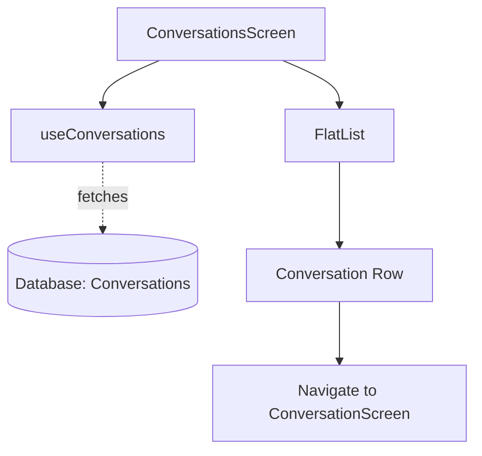

# `src/screens/ConversationsScreen.tsx`

## 1. Overview & Role
The `ConversationsScreen` acts as the inbox for the user's direct messages. It lists all active chat threads (conversations) the user is a part of. Tapping on a conversation navigates to the detailed message view.

## 2. Imports & Dependencies
- `React`: Core React library.
- React Native components (`View`, `Text`, `FlatList`, `TouchableOpacity`, `StyleSheet`, `ActivityIndicator`): Standard UI building blocks.
- `FontAwesome5`: Renders icons like the right chevron or empty state icon.
- `useAuth` (`../hooks/useAuth`): Gets the currently logged-in `user` ID.
- `useConversations` (`../hooks/useConversations`): Fetches the list of `conversations` and provides a `loading` state.
- `useAppTheme` (`../theme/ThemeContext`): Fetches `colors` for styling.
- Types (`Conversation`, `StackNavigationProp`, `AppStackParamList`): TypeScript typing for navigation and data.

## 3. Data Structures / Interfaces
### `NavProp`
**Definition**: `type NavProp = StackNavigationProp<AppStackParamList>;`
**Purpose**: Types the `navigation` prop injected by React Navigation.

## 4. Deep-Dive: Methods & Functions

### `ConversationsScreen({ navigation })`
- **Signature**: `export const ConversationsScreen = ({ navigation }: { navigation: NavProp }) => JSX.Element`
- **Purpose**: Main functional component for the inbox list.

### `renderItem({ item })`
- **Signature**: `const renderItem = ({ item }: { item: Conversation }) => JSX.Element`
- **Purpose**: Renders an individual conversation row in the `FlatList`.
- **Step-by-Step Logic**:
  1. Extracts the `other` participant from `item.participants[0]`. (The hook filters out the current user, so this is the person they are chatting with).
  2. Determines the `name` to display (displayName, fallback to email, fallback to 'Unknown').
  3. Extracts the text of the `lastMessage`, falling back to 'No messages yet'.
  4. Generates an `initials` string for the avatar by taking the first letter of the name and capitalizing it.
  5. Returns a `TouchableOpacity` wrapping the avatar, name, and last message.
  6. On press, it calls `navigation.navigate('Conversation', { conversationId: item.id })` to route to the specific chat.
- **Modification Guide**: If you want to show unread message badges, you would need to add an `unreadCount` to the `Conversation` model, pull it out here, and render a small red circle component if the count is greater than 0.

## 5. Code Examples
N/A - Screen component routed via React Navigation.

## 6. Data Flow Diagram

