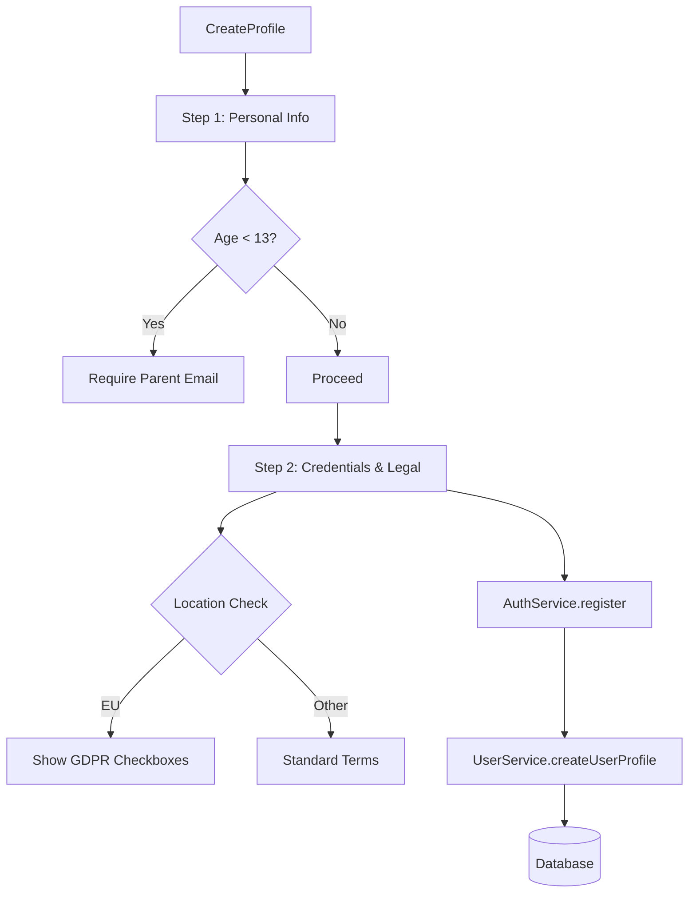

# `src/screens/CreateProfile.tsx`

## 1. Overview & Role
The `CreateProfile` screen handles user registration (signing up for a new account). It is a two-step wizard:
- **Step 1**: Collects personal information (username, real name, birthday) and handles COPPA compliance for minors (under 13).
- **Step 2**: Collects account credentials (email, password), checks IP-based location for GDPR compliance (EU users), and requires acceptance of legal policies.

## 2. Imports & Dependencies
- `React`, `useState`, `useEffect`: React hooks for managing the multi-step form state and side effects (like checking age or location).
- React Native components (`Alert`, `Platform`, `StyleSheet`, `ActivityIndicator`, `View`, `Text`, `TextInput`, `TouchableOpacity`, `Switch`, `SafeAreaView`): Used to construct the UI.
- `KeyboardAwareScrollView`: Ensures the form isn't hidden by the device's virtual keyboard.
- `DateTimePicker` from `@react-native-community/datetimepicker`: A native date picker used for selecting the user's birthday.
- `FontAwesome5`: For icons.
- `AuthService` (`../services/AuthService`): Handles registering the email/password with the backend and checking if an email is already in use.
- `UserService`, `createDefaultUser` (`../services/UserService`): Handles saving the extended user profile data (name, birthday, legal flags) to the database after auth succeeds.
- `useAppTheme` (`../theme/ThemeContext`): Provides theming colors.
- `CrashLogger` (`../services/LoggingService`): Logs errors.

## 3. Data Structures / Interfaces
*(This file primarily uses inline state variables rather than complex interfaces. It utilizes the `UserProfile` type under the hood when calling `createDefaultUser`.)*

### `Checkbox` Component
**Purpose**: A localized, reusable checkbox component used exclusively on this screen for accepting terms and policies.
**Props**: `value` (boolean), `onValueChange` (function), `label` (string), `themeColors` (object).

## 4. Deep-Dive: Methods & Functions

### `CreateProfile({ navigation })`
- **Signature**: `export const CreateProfile = ({ navigation }: any) => JSX.Element`
- **Purpose**: The main functional component.

### Age Check `useEffect`
- **Signature**: `useEffect(() => { ... }, [birthday])`
- **Purpose**: Calculates if the user is a minor whenever the `birthday` state changes.
- **Step-by-Step Logic**:
  1. Checks if `birthday` is set.
  2. Gets the `getFullYear()` of the birthday and compares it to the current year.
  3. If the difference is less than 13, sets `isMinor` to `true`, which reveals the Parent Email input in the UI.

### Location Check `useEffect`
- **Signature**: `useEffect(() => { ... }, [step])`
- **Purpose**: Detects if the user is in the EU when they transition to Step 2.
- **Step-by-Step Logic**:
  1. Only runs if `step === 2`.
  2. Sets `checkingLocation` to `true`.
  3. Makes an HTTP GET request to `https://ipapi.co/json/`. If it fails, falls back to `http://ip-api.com/json`.
  4. Parses the JSON response. If `in_eu`, `country_code === 'EU'`, or `continent_code === 'EU'` is found, sets `isEUUser` to `true`. This reveals GDPR consent checkboxes.
  5. In `finally`, sets `checkingLocation` to `false`.

### `handleNextStep1()`
- **Signature**: `const handleNextStep1 = () => void`
- **Purpose**: Validates Step 1 and moves to Step 2.
- **Step-by-Step Logic**:
  1. Checks if `displayName` and `birthday` exist. If not, shows an alert.
  2. If `isMinor` is true, verifies that `parentEmail` is provided.
  3. If all checks pass, calls `setStep(2)`.

### `handleSubmitProfile()`
- **Signature**: `const handleSubmitProfile = async () => Promise<void>`
- **Purpose**: Final validation and account creation.
- **Step-by-Step Logic**:
  1. **Basic Validation**: Checks for missing fields, mismatched passwords, or short passwords.
  2. **Compliance Validation**: Requires `termsAccepted` and `privacyAccepted`. If `isEUUser` is true, requires `acceptedDataProcessing`.
  3. **Uniqueness Check**: Calls `AuthService.isEmailInUse(email)`. Alerts and aborts if true.
  4. **Registration**: Calls `AuthService.register(email, password)`. This creates the auth record and returns the new `userId`.
  5. **Profile Creation**: Calls `createDefaultUser` to generate a profile object. Manually populates it with all the collected form data (names, birthday, minor flags, legal acceptance timestamps).
  6. **Save Profile**: Calls `UserService.createUserProfile(newUser)` to save this data to the database.
  7. Shows a success alert. The `AppNavigator` will automatically route the user to the Dashboard because the auth state changed.
- **Modification Guide**: To add an "opt-in to marketing" checkbox, add a state variable, render a new `<Checkbox>`, and add that boolean to the `newUser` payload before calling `createUserProfile`.

## 5. Code Examples
N/A - Routed automatically by `AuthNavigator`.

## 6. Data Flow Diagram

