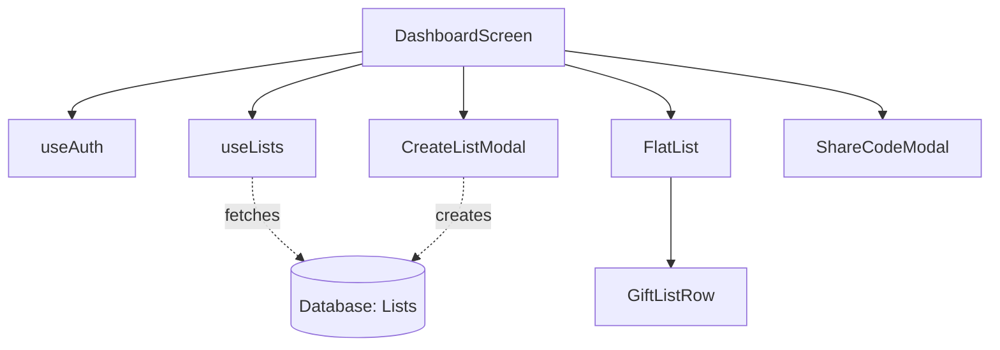

# `src/screens/DashboardScreen.tsx`

## 1. Overview & Role
The `DashboardScreen` is the main landing page for authenticated users. It displays a combined feed of the user's "Owned Lists" (gift lists they created) and "Shared Lists" (gift lists others shared with them). It allows users to create new lists, delete lists, join lists using a share code, and navigate into specific lists for more details.

## 2. Imports & Dependencies
- `React`, `useState`: Standard React hooks for local state management.
- React Native components (`View`, `Text`, `StyleSheet`, `ActivityIndicator`, `TouchableOpacity`, `Alert`, `TextInput`): Used to build the UI structure, inputs, and interactive elements.
- `FlatList` from `react-native-gesture-handler`: Renders the scrollable list of gift lists optimally.
- `useAuth` (`../hooks/useAuth`): Gets the currently logged-in `user`.
- `useLists` (`../hooks/useLists`): The main hook that fetches list data, and provides methods to `createList`, `deleteList`, and `joinList`.
- `useAppTheme` (`../theme/ThemeContext`): Fetches the current `colors` for styling (light/dark mode).
- Types (`GiftList`, `StackNavigationProp`, `AppStackParamList`): TypeScript definitions for props and data models.
- Components (`Button`, `CreateListModal`, `ShareCodeModal`, `GiftListRow`, `ConfirmationModal`): Custom UI components to keep the screen code clean and modular.
- `FontAwesome5`: Renders icons for the Floating Action Buttons (FABs).
- `CrashLogger`: Logs any unexpected errors to the backend reporting service.

## 3. Data Structures / Interfaces
### `DashboardNavProp`
**Definition**: `type DashboardNavProp = StackNavigationProp<AppStackParamList, 'Dashboard'>;`
**Purpose**: Types the `navigation` object injected into the component so TypeScript knows exactly what screens it can route to.

### `SectionItem`
**Definition**:
```typescript
type SectionItem =
  | { type: 'header'; label: string }
  | { type: 'list'; data: GiftList }
  | { type: 'empty'; label: string };
```
**Purpose**: A custom union type used to flatten the nested lists (Owned and Shared) into a single array for `FlatList` to render sequentially, injecting header titles ("My Lists", "Shared With Me") into the scrolling feed.

## 4. Deep-Dive: Methods & Functions

### `DashboardScreen(props)`
- **Signature**: `export const DashboardScreen = ({ navigation }: { navigation: DashboardNavProp }) => JSX.Element`
- **Purpose**: The main functional component.

### `handleCreateList(name: string, isSharable: boolean)`
- **Signature**: `const handleCreateList = async (name: string, isSharable: boolean) => Promise<void>`
- **Purpose**: Called when the user submits the `CreateListModal`.
- **Step-by-Step Logic**:
  1. Sets `createLoading` to `true` to show a spinner.
  2. Awaits `createList(name, isSharable)` from the `useLists` hook.
  3. Closes the creation modal by setting `createModalVisible` to `false`.
  4. If the new list returned a `shareCode` (because it is sharable), it saves the code in state and opens the `ShareCodeModal` to immediately show the user their new code.
  5. If an error occurs, it catches it, logs it with `CrashLogger.error`, and shows a native alert to the user.
  6. In `finally`, turns off the loading spinner.
- **Modification Guide**: If you want to add a default theme color to every newly created list, modify the `createList` signature in the hook, then update this function to pass a default color string.

### `handleJoinList()`
- **Signature**: `const handleJoinList = async () => Promise<void>`
- **Purpose**: Called when the user attempts to join a list via a 7-character share code.
- **Step-by-Step Logic**:
  1. Validates the `joinCode` state. If empty, it immediately returns.
  2. Sets `joinLoading` to `true`.
  3. Calls `joinList(joinCode.trim().toUpperCase())` to ensure formatting is correct regardless of user input.
  4. On success, hides the modal, clears the code from state, and shows a success `Alert`.
  5. On failure, shows an `Alert` with the error message.
  6. Finally, stops the loading state.

### `handleDeletePress(id: string)`
- **Signature**: `const handleDeletePress = (id: string) => void`
- **Purpose**: Prepares the UI to show a confirmation dialog before deleting.
- **Step-by-Step Logic**: Sets `deleteTargetId` to the provided `id` and opens the `ConfirmationModal`.

### `handleConfirmDelete()`
- **Signature**: `const handleConfirmDelete = async () => Promise<void>`
- **Purpose**: Executes the actual deletion after the user confirms.
- **Step-by-Step Logic**:
  1. Exits if `deleteTargetId` is null.
  2. Calls `deleteList(deleteTargetId)`.
  3. Logs any errors via `CrashLogger`.
  4. Finally, closes the confirmation modal and resets `deleteTargetId` to null.

### `renderList({ item })`
- **Signature**: `const renderList = ({ item }: { item: GiftList }) => JSX.Element`
- **Purpose**: Renders a single `GiftListRow`.
- **Step-by-Step Logic**:
  1. Returns the `<GiftListRow>` component.
  2. Passes an `onPress` callback that navigates to the `ListDetail` screen, passing the `listId` and `ownerId`.
  3. Conditionally passes an `onDelete` callback *only* if the list's `ownerId` matches the currently logged-in `user?.uid`. (You cannot delete lists shared with you).

## 5. Code Examples
N/A - This is a top-level screen routed to by `AppNavigator.tsx`, it is not imported and used inside other components.

## 6. Data Flow Diagram

