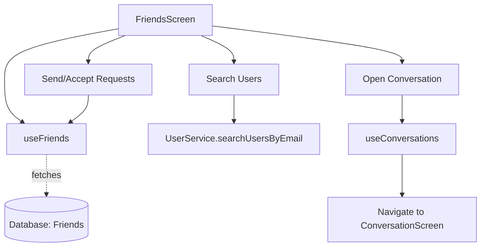

# `src/screens/FriendsScreen.tsx`

## 1. Overview & Role
The `FriendsScreen` allows users to manage their social connections within the app. It provides a search bar to find other users by email, send friend requests, accept/decline incoming requests, and view the list of currently accepted friends. It also provides a quick-action button to start a conversation with a friend.

## 2. Imports & Dependencies
- `React`, `useState`: React hooks for managing tabs, search input, and result states.
- React Native components (`View`, `Text`, `TextInput`, `TouchableOpacity`, `StyleSheet`, `FlatList`, `ActivityIndicator`, `Alert`): Used for UI layout and lists.
- `FontAwesome5`: For icons (search, user-plus, check, times, comment).
- `useAuth` (`../hooks/useAuth`): Gets the logged-in user.
- `useFriends` (`../hooks/useFriends`): The core hook that fetches the friend lists (`accepted`, `pending`) and provides the logic to interact with them (`sendRequest`, `acceptRequest`, etc.).
- `useConversations` (`../hooks/useConversations`): Provides the `openConversation` method to jump from a friend profile to a chat room.
- `UserService` (`../services/UserService`): Provides `searchUsersByEmail` to find people not currently in the friend list.
- `useAppTheme`: For dynamic styling.
- Types (`Friend`, `UserProfile`, `StackNavigationProp`): TypeScript definitions.

## 3. Data Structures / Interfaces
### `NavProp`
**Definition**: `type NavProp = StackNavigationProp<AppStackParamList>;`
**Purpose**: Types the `navigation` object. Note that it uses the entire `AppStackParamList` because it needs to navigate out of the `FriendsStack` and into the `MessagesTab` when a chat is opened.

## 4. Deep-Dive: Methods & Functions

### `FriendsScreen({ navigation })`
- **Signature**: `export const FriendsScreen = ({ navigation }: { navigation: NavProp }) => JSX.Element`
- **Purpose**: Main functional component.

### `handleSearch()`
- **Signature**: `const handleSearch = async () => Promise<void>`
- **Purpose**: Executes when the user submits the search input.
- **Step-by-Step Logic**:
  1. Trims `searchQuery` and exits if empty.
  2. Sets `searching` to `true` to show a spinner.
  3. Calls `UserService.searchUsersByEmail(searchQuery)`.
  4. Filters the returned results to remove the current user (you can't add yourself as a friend).
  5. Sets the filtered results to `searchResults`.
  6. Catches errors and shows an alert.
  7. In `finally`, sets `searching` to `false`.

### `handleSendRequest(targetId: string)`
- **Signature**: `const handleSendRequest = async (targetId: string) => Promise<void>`
- **Purpose**: Sends a friend request to a searched user.
- **Step-by-Step Logic**:
  1. Awaits `sendRequest(targetId)` from the `useFriends` hook.
  2. On success, alerts the user, and clears the search results and query from the screen.
  3. Catches errors and alerts the user.
- **Modification Guide**: If you want to prevent users from sending more than 5 requests a day, you would implement that logic in the `useFriends` hook or `FriendService`, and handle the specific "rate limit" error here to show a custom alert.

### `handleMessage(friendUserId: string)`
- **Signature**: `const handleMessage = async (friendUserId: string) => Promise<void>`
- **Purpose**: Navigates the user to a direct messaging screen with the selected friend.
- **Step-by-Step Logic**:
  1. Calls `openConversation(friendUserId)` from the `useConversations` hook. This either creates a new conversation or returns the ID of an existing one.
  2. Uses `navigation.navigate` to switch to the `MessagesTab`, specifically loading the `Conversation` screen, passing the `conversationId`.

### `renderFriend({ item })`
- **Signature**: `const renderFriend = ({ item }: { item: Friend }) => JSX.Element`
- **Purpose**: Renders a single row in the FlatList for the 'friends' or 'requests' tab.
- **Step-by-Step Logic**:
  1. Determines the display name and extracts the first letter for the avatar.
  2. Checks if `item.status === 'pending'`.
  3. If pending, checks if `item.userId === user?.uid` to see if the current user sent the request, or is receiving it.
  4. Returns a layout with "Accept/Decline" buttons if receiving, or just "Request sent" text if sending.
  5. If `status !== 'pending'`, renders the accepted friend layout with "Message" and "Remove Friend" buttons.
  6. The Remove Friend button triggers an `Alert.alert` for confirmation before calling `removeFriend(item.id)`.

### `renderSearchResult({ item })`
- **Signature**: `const renderSearchResult = ({ item }: { item: UserProfile }) => JSX.Element`
- **Purpose**: Renders rows in the search dropdown overlay.
- **Step-by-Step Logic**:
  1. Checks if the searched user is already in the `accepted` or `pending` arrays.
  2. If they are, shows text saying "Added".
  3. If not, shows an "Add Friend" button that calls `handleSendRequest(item.id)`.

## 5. Code Examples
N/A - Screen component routed via React Navigation.

## 6. Data Flow Diagram

