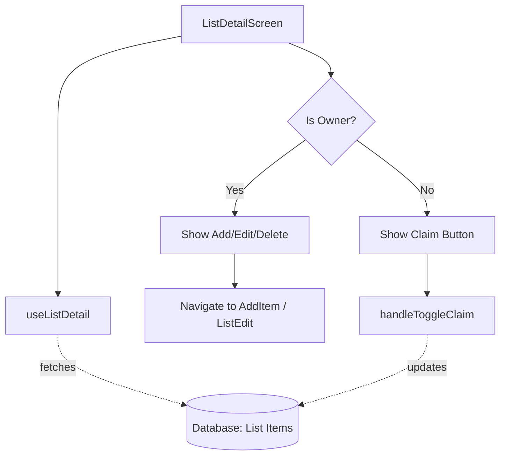

# `src/screens/ListDetailScreen.tsx`

## 1. Overview & Role
The `ListDetailScreen` displays the contents (items) of a specific gift list. It handles two distinct views:
1. **Owner View**: The user who created the list can add items, edit the list details, and delete items. They cannot "claim" items.
2. **Guest View**: A user who joined the list can view items and "claim" them (mark them as purchased), but they cannot add, edit, or delete items.

## 2. Imports & Dependencies
- `React`, `useEffect`, `useRef`, `useState`: Standard React hooks.
- React Native components (`View`, `Text`, `StyleSheet`, `TouchableOpacity`, `SafeAreaView`, `ActivityIndicator`, `Alert`): UI building blocks.
- `FlatList`: Efficiently renders the list of items.
- `StackScreenProps`, `AppStackParamList`: Typing for React Navigation.
- `useAuth`: Gets the currently logged-in user to determine permissions.
- `useListDetail` (`../hooks/useListDetail`): The primary hook that fetches the list items, handles real-time updates, and provides the `handleToggleClaim` function.
- `useAppTheme`: Theming support.
- `FontAwesome5`: For icons (edit, plus).
- Components (`GiftItemRow`, `ItemDetailModal`, `ConfirmationModal`): Custom components for rows and popups.
- `CrashLogger`, `ListService`: Services for error tracking and database actions (like deleting an item).

## 3. Data Structures / Interfaces
### `Props`
**Definition**: `type Props = StackScreenProps<AppStackParamList, 'ListDetail'>;`
**Purpose**: Defines the navigation route props, specifically that `route.params` contains `listId` and `ownerId`.

## 4. Deep-Dive: Methods & Functions

### `ListDetailScreen({ route, navigation })`
- **Signature**: `export const ListDetailScreen = ({ route, navigation }: Props) => JSX.Element`
- **Purpose**: Main functional component.

### Determine Permissions
- **Logic**: Extracts `currentUserId`. Compares it to `route.params.ownerId`. If they match, `isOwner` is set to `true`. This boolean is passed down to components to hide/show buttons.

### `handleDeletePress(id: string)`
- **Signature**: `const handleDeletePress = (id: string) => void`
- **Purpose**: Opens the delete confirmation dialog for a specific item.

### `handleConfirmDelete()`
- **Signature**: `const handleConfirmDelete = async () => Promise<void>`
- **Purpose**: Actually deletes the item from the database.
- **Step-by-Step Logic**:
  1. Checks if `deleteTargetId` exists.
  2. Calls `ListService.deleteItem(listId, deleteTargetId)`.
  3. Closes modal and resets state. Error logging is handled via `CrashLogger`.

### Header Configuration `useEffect`
- **Signature**: `useEffect(() => { ... }, [...])`
- **Purpose**: Dynamically adds an "Edit" icon to the top right of the navigation header if the user is the owner.
- **Step-by-Step Logic**:
  1. Checks if `isOwner` is true.
  2. Calls `navigation.setOptions({ headerRight: () => <TouchableOpacity>... })`.
  3. The button navigates to `ListEdit` passing the `listId`.

### Render Logic
- Uses `FlatList` to render `GiftItemRow` components.
- If `isOwner` is true, renders a floating action button (FAB) at the bottom to navigate to `AddItem`.
- Renders the `ItemDetailModal` (which opens when a row is tapped, passing `selectedItem` state).

## 5. Code Examples
N/A - Routed via React Navigation.

## 6. Data Flow Diagram

