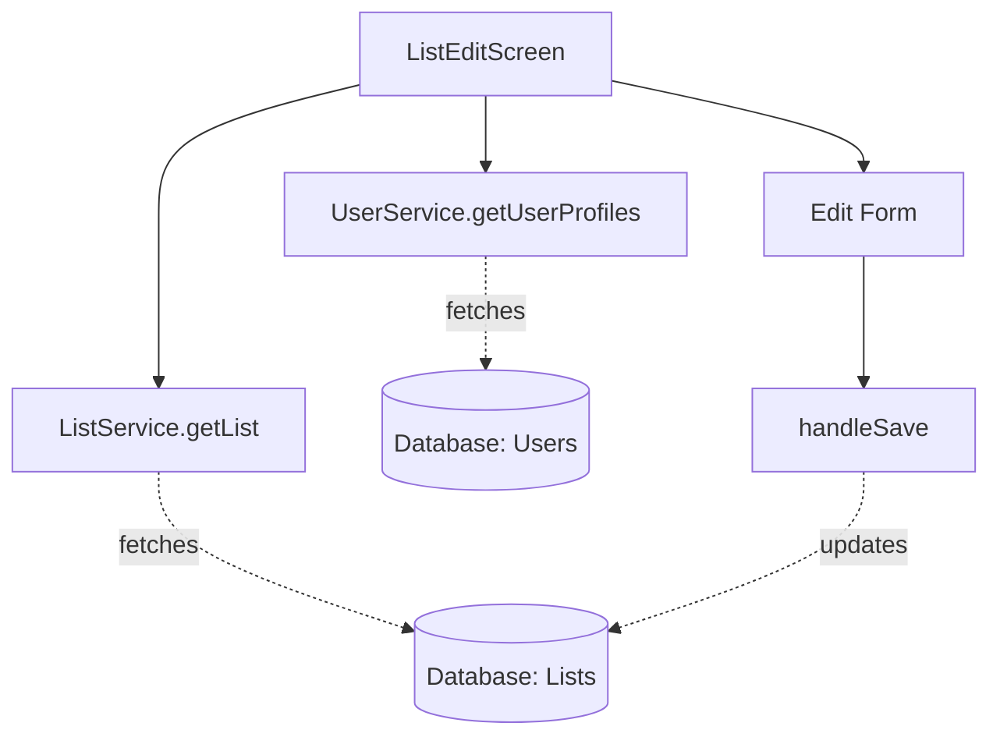

# `src/screens/ListEditScreen.tsx`

## 1. Overview & Role
The `ListEditScreen` allows the owner of a gift list to modify its title and privacy settings (make it public/private). It also displays the list's unique "Share Code" (if shareable) and lists all the users who have currently joined the list.

## 2. Imports & Dependencies
- `React`, `useState`, `useEffect`, `useCallback`: Hooks for state and data fetching.
- React Native components (`View`, `Text`, `TextInput`, `StyleSheet`, `Switch`, `ActivityIndicator`, `Alert`, `TouchableOpacity`): Standard UI elements.
- `KeyboardAwareScrollView`: Keeps inputs visible when typing.
- `FontAwesome5`: Icons for copying, editing.
- `* as Clipboard` from `expo-clipboard`: Used to copy the share code to the device's clipboard.
- `useRoute`, `useNavigation`: React Navigation hooks used because props aren't explicitly typed at the function signature level here.
- `supabase`: Direct Supabase client import (used here to query `list_members`).
- `ListService`, `UserService`: Backend services for updating the list and fetching user profiles.
- `useAuth`: To verify list ownership.
- `useAppTheme`: Theming context.

## 3. Data Structures / Interfaces
### `ListEditScreenRouteProp`
**Definition**: `type ListEditScreenRouteProp = RouteProp<AppStackParamList, 'ListEdit'>;`
**Purpose**: Types the `useRoute` hook so TypeScript knows `route.params.listId` exists.

## 4. Deep-Dive: Methods & Functions

### `fetchData()`
- **Signature**: `const fetchData = useCallback(async () => { ... }, [...])`
- **Purpose**: Loads the list details and the profiles of people who joined it.
- **Step-by-Step Logic**:
  1. Calls `ListService.getList(listId)`.
  2. If missing, alerts and goes back.
  3. Updates local state (`title`, `isPrivate`).
  4. Queries Supabase `list_members` table for all rows matching the `listId` where role is NOT 'owner'.
  5. Extracts the `user_id`s from the results.
  6. Calls `UserService.getUserProfiles(uids)` to get their names and emails.
  7. Saves to `participants` state.

### Ownership Verification `useEffect`
- **Signature**: `useEffect(() => { ... }, [...])`
- **Purpose**: A security check to ensure non-owners cannot view this screen.
- **Step-by-Step Logic**:
  1. Runs after `loading` finishes.
  2. Compares `user?.uid` to `list?.ownerId`.
  3. If they don't match, throws an `Alert` and forcefully calls `navigation.goBack()`.

### `handleSave()`
- **Signature**: `const handleSave = async () => Promise<void>`
- **Purpose**: Submits the edited title and privacy settings to the backend.
- **Step-by-Step Logic**:
  1. Validates `title`.
  2. Calls `ListService.updateList(listId, { title, isPrivate })`.
  3. Shows success alert and navigates back.

### `copyToClipboard()`
- **Signature**: `const copyToClipboard = async () => Promise<void>`
- **Purpose**: Copies the share code using Expo Clipboard.

## 5. Code Examples
N/A - Routed via React Navigation.

## 6. Data Flow Diagram

