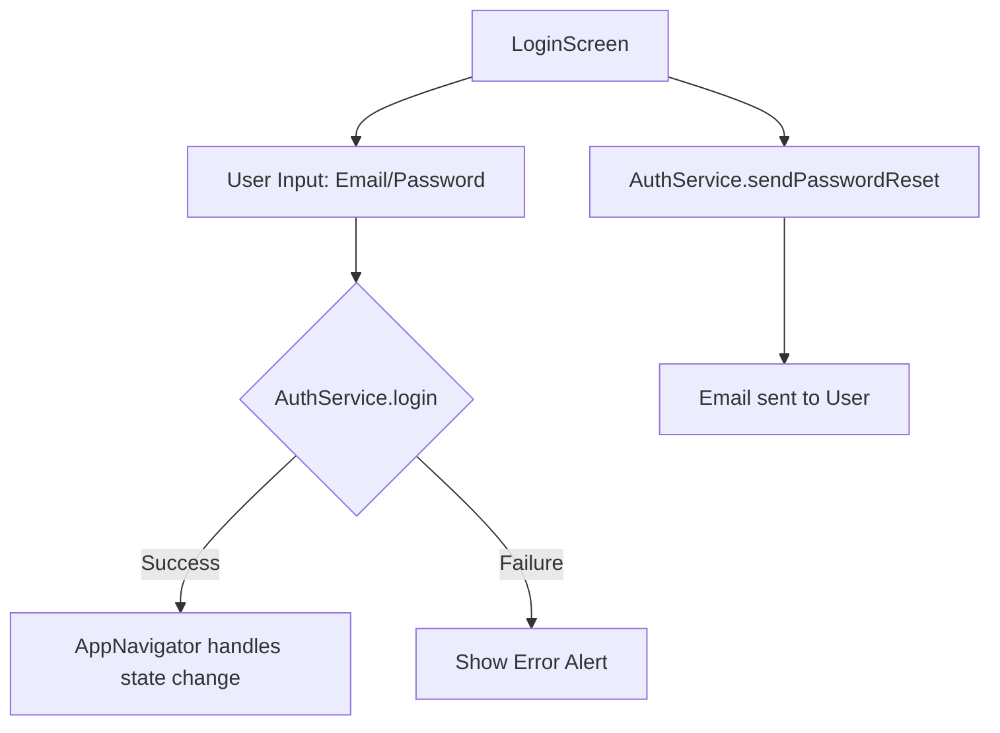

# `src/screens/LoginScreen.tsx`

## 1. Overview & Role
The `LoginScreen` is the entry point for returning users. It provides an email and password form to authenticate against the backend. It also provides navigation links to recover a forgotten password or jump to the `CreateProfile` registration screen.

## 2. Imports & Dependencies
- `React`, `useState`: Core React hooks for managing form inputs and loading states.
- React Native core components (`View`, `Text`, `TextInput`, `TouchableOpacity`, `Alert`, etc.): Used for standard UI construction.
- `KeyboardAwareScrollView` from `react-native-keyboard-aware-scroll-view`: A specialized wrapper that automatically scrolls the screen up when the on-screen keyboard appears, preventing inputs from being hidden on small devices.
- `AuthService` (`../services/AuthService`): Contains the actual Firebase/Supabase logic to authenticate users or send password resets.
- `FontAwesome5`: For rendering icons inside the text inputs.
- `useAppTheme` (`../theme/ThemeContext`): Provides dynamic colors to style the components for light/dark modes.
- `CrashLogger` (`../services/LoggingService`): Captures failed login attempts or crashes.

## 3. Data Structures / Interfaces

### `LoginScreenNavigationProp`
**Definition**: `type LoginScreenNavigationProp = StackNavigationProp<AuthStackParamList, 'Login'>;`
**Purpose**: Tells TypeScript that this component lives in the `AuthStackParamList` and has access to the navigation object.

### `LoginScreenProps`
**Definition**:
```typescript
interface LoginScreenProps {
  navigation: LoginScreenNavigationProp;
}
```
**Purpose**: Defines the props that React Navigation automatically injects into the component.

## 4. Deep-Dive: Methods & Functions

### `LoginScreen({ navigation })`
- **Signature**: `export const LoginScreen = ({ navigation }: LoginScreenProps) => JSX.Element`
- **Purpose**: Main functional component rendering the form.

### `handleLogin()`
- **Signature**: `const handleLogin = async () => Promise<void>`
- **Purpose**: Validates input and attempts to authenticate.
- **Step-by-Step Logic**:
  1. Checks if `email` or `password` is empty. If so, triggers a native `Alert` telling the user to fill in all fields, and returns early.
  2. Sets `loading` state to `true` (which changes the Login button into a spinner).
  3. Tries to call `AuthService.login(email, password)`.
  4. If successful, React Navigation automatically reacts to the authentication state change (handled globally in `AppNavigator.tsx`), so no explicit navigation call is needed here.
  5. If an error is caught, it logs the error to `CrashLogger` and shows an `Alert` with the specific error message (e.g., "Invalid Credentials").
  6. In `finally`, resets `loading` to `false`.
- **Modification Guide**: To add a "Remember Me" toggle, add a state variable, pass it into a modified `AuthService.login` signature, and update the backend service to set a persistent token.

### Inline Password Reset Handler
- **Signature**: `onPress={async () => { ... }}` on the "Forgot password?" `TouchableOpacity`.
- **Purpose**: Sends a reset email if the email field is populated.
- **Step-by-Step Logic**:
  1. Checks if the `email` field is filled out. If not, alerts the user to enter it first.
  2. Calls `AuthService.sendPasswordReset(email)`.
  3. On success, alerts the user to check their inbox.
  4. On failure, catches the error and displays an alert with the error message.

### `createStyles(colors)`
- **Signature**: `const createStyles = (colors: ThemeColors) => StyleSheet.create({ ... })`
- **Purpose**: A factory function that generates React Native stylesheets dynamically using the provided theme `colors`. This is a common pattern in this app for handling dark mode.

## 5. Code Examples
N/A - Routed automatically by `AuthNavigator`.

## 6. Data Flow Diagram

