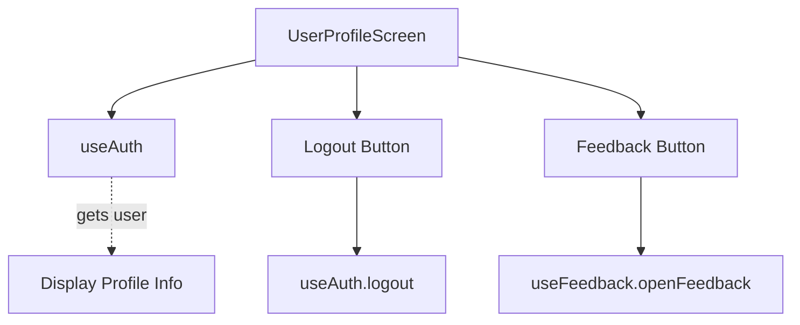

# `src/screens/UserProfileScreen.tsx`

## 1. Overview & Role
The `UserProfileScreen` is a simple settings and profile viewing page. It displays the current user's name, email, and profile avatar. It provides actionable buttons to log out of the application and to send feedback.

## 2. Imports & Dependencies
- `React`: Core React library.
- React Native components (`View`, `Text`, `StyleSheet`): Used for UI layout.
- `ScrollView` from `react-native-gesture-handler`: Provides a scrollable container.
- `useAuth` (`../hooks/useAuth`): Hook to access the current `user` data and the `logout` function.
- `Button` (`../components/common/Button`): Reusable, styled button component.
- `Constants` from `expo-constants`: Accesses app metadata (like the version number from `app.json`).
- `useFeedback` (`../theme/FeedbackContext`): Hook that exposes `openFeedback`, triggering the global feedback modal.
- `ProfileImage` (`../components/common/ProfileImage`): Component that generates an avatar with the user's initials.
- `useAppTheme` (`../theme/ThemeContext`): Fetches `colors` for styling.

## 3. Data Structures / Interfaces
*(No complex interfaces defined here, relies entirely on `useAuth`'s user object.)*

## 4. Deep-Dive: Methods & Functions

### `UserProfileScreen()`
- **Signature**: `export const UserProfileScreen = () => JSX.Element`
- **Purpose**: Main functional component.
- **Step-by-Step Logic**:
  1. Extracts `user` and `logout` from `useAuth`.
  2. Extracts `openFeedback` from `useFeedback`.
  3. Calculates `fullName` by combining `givenName` and `familyName`. Falls back to `displayName` or 'User'.
  4. Retrieves `appVersion` from `Constants.expoConfig?.version`.
  5. Renders a `ScrollView` containing:
     - Header: Displays `ProfileImage` and name/email.
     - Account Section: Renders the Logout `<Button variant="danger">`. Pressing this calls `logout()`, which clears local auth state, causing `AppNavigator` to automatically route back to the Login screen.
     - Support Section: Renders a Send Feedback `<Button>`. Pressing this opens the global feedback modal.
     - Footer: Displays the current App Version.
- **Modification Guide**: To add a "Change Password" button, you would add another `<Button>` in the Account section, and pass an `onPress` handler that navigates to a new `ChangePassword` screen in the `ProfileStack`.

## 5. Code Examples
N/A - Screen routed via React Navigation's Bottom Tabs.

## 6. Data Flow Diagram

