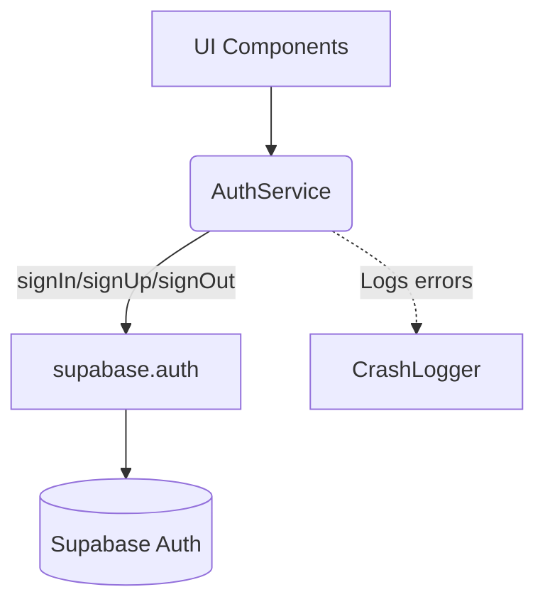

# Documentation: src/services/AuthService.ts

## 1. Overview & Role
The `AuthService` acts as the bridge between the app and Supabase's authentication system. It provides all functions required for users to log in, register, log out, and manage their passwords.

## 2. Imports & Dependencies
- `supabase` from `../api/supabase`: Provides the initialized connection to Supabase to execute auth commands.
- `CrashLogger` from `./LoggingService`: Used to silently report any background failures (like logout errors) without crashing the app.

## 3. Data Structures / Interfaces
No specific interfaces are defined here, but the functions return basic primitives or simple objects.

## 4. Deep-Dive: Methods & Functions

### `login(email, password)`
- **Signature**: `async login(email: string, password: string): Promise<void>`
- **Purpose**: Authenticates an existing user.
- **Step-by-Step Logic**:
  1. Calls `supabase.auth.signInWithPassword`.
  2. Modifies the email on the fly: `email.trim().toLowerCase()` ensures that " User@Email.com " is treated as "user@email.com".
  3. Checks for an `error` returned by Supabase.
  4. If an error exists, it throws a new Error by passing the message through a helper function `mapAuthError`.
- **Error Handling**: Throws an error to be caught by the UI (so it can show an alert).
- **Modification Guide**: To add magic link logins, you would create a new method calling `supabase.auth.signInWithOtp({ email })`.

### `register(email, password)`
- **Signature**: `async register(email: string, password: string): Promise<{ id: string; email: string }>`
- **Purpose**: Creates a new user account.
- **Step-by-Step Logic**:
  1. Calls `supabase.auth.signUp`, again cleaning the email with `.trim().toLowerCase()`.
  2. Checks for `error`. If it exists, throws mapped error.
  3. Validates that `data.user` exists. If not, throws a specific failure message.
  4. Returns the new user's ID and email.
- **Modification Guide**: To save the user's first name during signup, add a `metadata` payload to the options in `signUp()`.

### `logout()`
- **Signature**: `async logout(): Promise<void>`
- **Purpose**: Signs the user out locally and destroys the active session on the server.
- **Step-by-Step Logic**:
  1. Wraps the call in a `try...catch` block.
  2. Calls `supabase.auth.signOut()`.
- **Error Handling**: If `signOut` fails (e.g., no internet), it does *not* throw to the user. Instead, it logs the error silently via `CrashLogger.error`.

### `sendPasswordReset(email)`
- **Signature**: `async sendPasswordReset(email: string): Promise<void>`
- **Purpose**: Sends a reset link to the user's email.
- **Step-by-Step Logic**: Cleans the email string and calls `supabase.auth.resetPasswordForEmail`.

### `isEmailInUse(email)`
- **Signature**: `async isEmailInUse(email: string): Promise<boolean>`
- **Purpose**: Checks if an email is already registered, usually during a multi-step signup process.
- **Step-by-Step Logic**:
  1. Queries the `profiles` table looking for a match on the cleaned email.
  2. Uses `.maybeSingle()` which returns 0 or 1 row without throwing an error if 0 are found.
  3. Returns `true` if `data !== null`.

### `mapAuthError(message)` (Internal Helper)
- **Signature**: `function mapAuthError(message: string): string`
- **Purpose**: Translates confusing Supabase error strings into user-friendly messages.
- **Step-by-Step Logic**: A series of `if` statements checking if the raw message includes specific keywords (like "Invalid login"). Returns friendly text.

## 5. Code Examples
```typescript
import { AuthService } from '../services/AuthService';

async function handleLoginButton() {
  try {
    await AuthService.login(emailInput, passwordInput);
    // Navigate to dashboard
  } catch (error) {
    alert(error.message); // Displays the mapped, user-friendly error
  }
}
```

## 6. Data Flow Diagram

