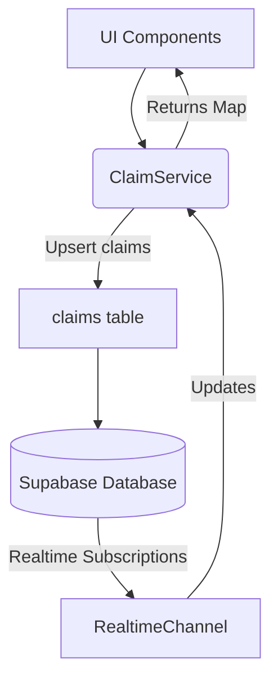

# Documentation: src/services/ClaimService.ts

## 1. Overview & Role
This service manages the logic for "claiming" a gift item (e.g., indicating "I am buying this"). Claims are inherently sensitive because the owner of the list must *never* see who claimed the item, while other members *should* see it to avoid duplicate purchases.

## 2. Imports & Dependencies
- `supabase` from `../api/supabase`.
- `ItemClaim` model.

## 3. Data Structures / Interfaces
None directly defined.

## 4. Deep-Dive: Methods & Functions

### `claimItem(itemId, userId, listOwnerId, listId)`
- **Signature**: `async claimItem(itemId: string, userId: string, listOwnerId: string, listId: string): Promise<void>`
- **Purpose**: Marks an item as claimed by the current user.
- **Step-by-Step Logic**: Uses `.upsert()` into the `claims` table. The inclusion of `list_owner_id` is critical—it exists entirely so that database Row Level Security (RLS) can easily say "If the current user is `list_owner_id`, deny access to this row."
- **Modification Guide**: If you want to add a "quantity claimed" (e.g., claiming 2 out of 5 requested towels), you would add `quantity` to this function and to the database table.

### `listenToClaimsForList(listId, onUpdate, onError)`
- **Signature**: `listenToClaimsForList(listId: string, onUpdate: (claims: Record<string, ItemClaim>) => void, onError: (err: Error) => void): () => void`
- **Purpose**: Subscribes to claim updates for an entire list.
- **Step-by-Step Logic**:
  1. *Two-Step Fetch*: Since claims are tied to `items`, and the UI is viewing a `list`, the function first fetches all `itemIds` for the given `listId`.
  2. If there are items, it queries the `claims` table `.in('item_id', itemIds)`.
  3. *Data Transformation*: Instead of returning an array, it returns a `Record<string, ItemClaim>` (a dictionary/object). This allows the UI to instantly check if an item is claimed by doing `claimsMap[itemId]` instead of looping through an array.
  4. Sets up the realtime channel.

## 5. Code Examples
```typescript
const [claims, setClaims] = useState<Record<string, ItemClaim>>({});

// UI Render check:
const isClaimed = !!claims[item.id];
```

## 6. Data Flow Diagram

