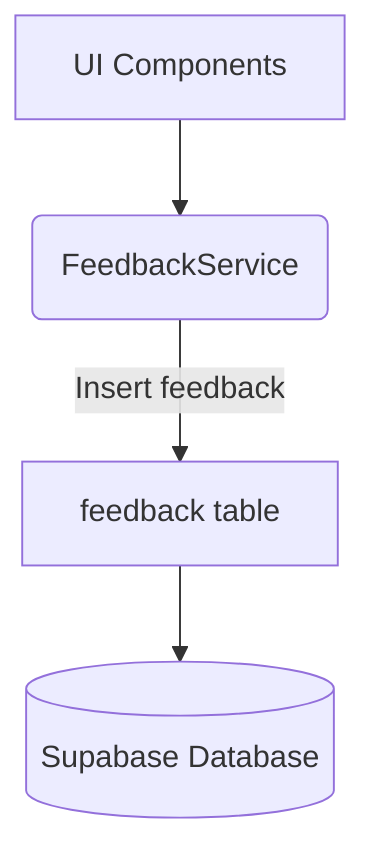

# Documentation: src/services/FeedbackService.ts

## 1. Overview & Role
A simple service allowing users to submit bug reports or feature requests directly to the database. 

## 2. Imports & Dependencies
- `Platform` from `react-native`: Used to log whether the user is on iOS or Android.
- `supabase` from `../api/supabase`.

## 3. Data Structures / Interfaces
None.

## 4. Deep-Dive: Methods & Functions

### `submitFeedback(userId, userEmail, text, type, isAnonymous)`
- **Signature**: `async submitFeedback(userId: string, userEmail: string, text: string, type = 'general', isAnonymous = false): Promise<void>`
- **Purpose**: Writes a feedback row to the database.
- **Step-by-Step Logic**:
  1. Validates that `text` isn't entirely whitespace (`!text.trim()`). Throws an error if so.
  2. Constructs the insert payload.
  3. If `isAnonymous` is true, it intentionally sends `null` for the `user_id` and `user_email`, protecting privacy.
  4. Automatically appends `Platform.OS` (e.g., 'ios' or 'android') so developers know which OS experienced the bug.
- **Modification Guide**: To add an optional "screenshot URI" to feedback, add the parameter to the function, and insert it into a `screenshot_url` column in the payload.

## 5. Code Examples
```typescript
await FeedbackService.submitFeedback(
  user.uid,
  user.email,
  "The app crashed when I clicked Add Item",
  "bug"
);
```

## 6. Data Flow Diagram

