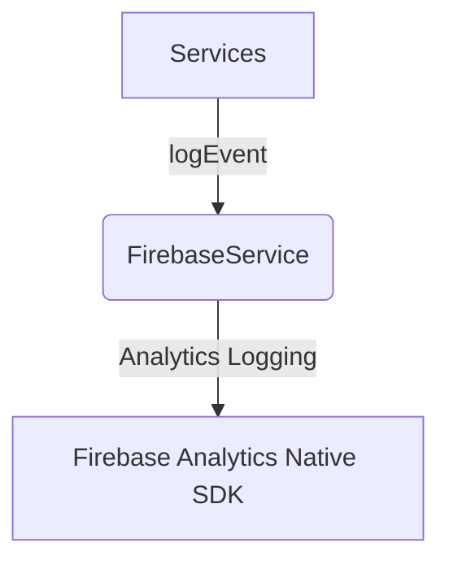

# Documentation: src/services/FirebaseService.ts

## 1. Overview & Role
This file acts as a very thin wrapper around Firebase Analytics. While `LoggingService.ts` handles complex logging and crash reporting, this file provides a simple event logger specifically utilized by other third-party tracking services (like PostHog's debug modes, if implemented).

## 2. Imports & Dependencies
- `analytics` from `@react-native-firebase/analytics`.
- `Platform` from `react-native`.

## 3. Data Structures / Interfaces
None.

## 4. Deep-Dive: Methods & Functions

### `logEvent(name, params)`
- **Signature**: `async logEvent(name: string, params?: Record<string, any>)`
- **Purpose**: Sends a custom named event to Firebase Analytics.
- **Step-by-Step Logic**:
  1. Aborts immediately if running on the web (`Platform.OS === 'web'`).
  2. Wraps the native `analytics().logEvent()` call in a try/catch.
  3. If the call fails (e.g., ad-blockers, missing permissions), it silently catches the error and does nothing. Analytics should never crash the user's app.
- **Modification Guide**: If you want to automatically append the user's ID to every single event fired here, you could pull it from state/storage and add it to the `params` object before firing.

## 5. Code Examples
```typescript
await FirebaseService.logEvent('button_clicked', { buttonName: 'checkout' });
```

## 6. Data Flow Diagram

