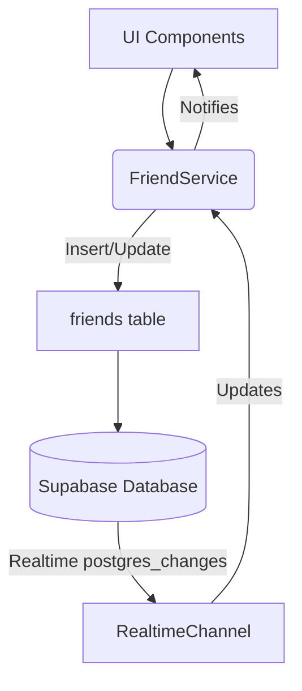

# Documentation: src/services/FriendService.ts

## 1. Overview & Role
This service handles all operations related to social connections in the app. Users can send, accept, decline, and remove friend requests. Crucially, it provides a real-time subscription method so the UI updates instantly when a friend request is accepted.

## 2. Imports & Dependencies
- `supabase` from `../api/supabase`: Realtime socket connections and database writes.
- `RealtimeChannel` from `@supabase/supabase-js`: The typing for the websocket connection.
- `Friend`, `FriendStatus`, `UserProfile`: Models defining relationship states.

## 3. Data Structures / Interfaces
None specifically defined here, utilizes models from `models.ts`.

## 4. Deep-Dive: Methods & Functions

### `sendRequest(currentUserId, targetUserId)`
- **Signature**: `async sendRequest(currentUserId: string, targetUserId: string): Promise<void>`
- **Purpose**: Initiates a friend request.
- **Step-by-Step Logic**: Inserts a new row into the `friends` table with `requester_id`, `addressee_id`, and hardcodes the initial status to `'pending'`.
- **Modification Guide**: If you wanted to add a "message" to a friend request, you would add a `message` parameter to the function, and include it in the `.insert()` payload (assuming the column exists in the database).

### `acceptRequest(friendRowId)` / `declineRequest(friendRowId)`
- **Signature**: `async acceptRequest(friendRowId: string): Promise<void>`
- **Purpose**: Modifies the `status` of an existing friend row to 'accepted' or 'declined'.
- **Step-by-Step Logic**: Updates the row matching `id = friendRowId`.

### `listenToFriends(userId, onUpdate, onError)`
- **Signature**: `listenToFriends(userId: string, onUpdate: (friends: Friend[]) => void, onError: (err: Error) => void): () => void`
- **Purpose**: Establishes a real-time websocket connection to the `friends` table to watch for changes.
- **Step-by-Step Logic**:
  1. Declares a function `fetchAndNotify` that queries the database.
  2. The query uses Foreign Key joins (`profiles!friends_requester_id_fkey`) to fetch the `UserProfile` data of the *other* person simultaneously. This means we get the friend's name and photo in one go, without needing a second API call.
  3. It filters using `.or(requester_id.eq.${userId},addressee_id.eq.${userId})` to get all relationships where the current user is involved.
  4. It immediately calls `fetchAndNotify()` to get the initial data load.
  5. It opens a Supabase `channel`, subscribing to `postgres_changes` on the `friends` table. If any insert/update/delete happens, it triggers `fetchAndNotify` again.
  6. Returns an unsubscribe/cleanup function (`() => { supabase.removeChannel(channel); }`).

### `mapRowToFriend(row, currentUserId)` (Internal Helper)
- **Purpose**: Formats the complex joined database row into a clean `Friend` object.
- **Logic Details**: It checks `iRequested = row.requester_id === currentUserId`. If the current user sent the request, the "friend's" profile is the `addressee_profile`. If they received it, the friend is the `requester_profile`.

## 5. Code Examples
```typescript
// Subscribing in a React Hook
useEffect(() => {
  const unsubscribe = FriendService.listenToFriends(
    'my-uid',
    (friendsList) => setFriends(friendsList), // Update state
    (error) => console.error(error)
  );
  return () => unsubscribe(); // Cleanup on unmount
}, []);
```

## 6. Data Flow Diagram

