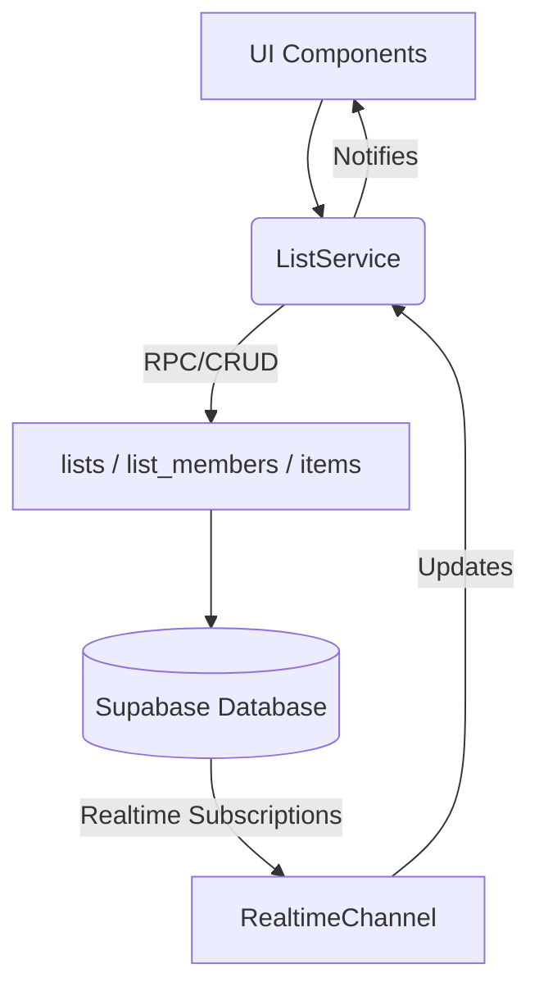

# Documentation: src/services/ListService.ts

## 1. Overview & Role
This is the largest service in the app. It manages the core functionality: Creating Gift Lists, joining shared lists, and adding/editing/deleting items within those lists.

## 2. Imports & Dependencies
- `supabase` from `../api/supabase`: DB connections.
- `RealtimeChannel` from `@supabase/supabase-js`.
- Core models: `GiftList`, `GiftItem`.

## 3. Data Structures / Interfaces
- **`CreateListResult`**: `interface { listId: string; shareCode: string | null; }`. Returned when creating a new list so the UI can immediately display the generated share code.

## 4. Deep-Dive: Methods & Functions

### `generateShareCode()` (Internal)
- **Signature**: `function generateShareCode(): string`
- **Purpose**: Creates a random 7-character alphanumeric string (e.g., "A7F9B2C").
- **Step-by-Step Logic**: Uses an array of valid characters and randomly selects from it 7 times, joining the result.

### `createList(ownerId, title, isSharable)`
- **Signature**: `async createList(ownerId: string, title: string, isSharable = false): Promise<CreateListResult>`
- **Step-by-Step Logic**:
  1. Generates a share code if `isSharable` is true.
  2. Inserts the new list into the `lists` table.
  3. **Crucial Step**: Explicitly inserts the owner into the `list_members` table with the role 'owner'. Even though Supabase RLS policies might implicitly handle this, explicitly defining the relationship ensures queries for "lists I belong to" work cleanly.
  4. Returns the new ID and code.

### `updateList(listId, updates)`
- **Step-by-Step Logic**: Dynamically builds a `payload` object. If `updates.isPrivate` changes to false (meaning it is now public/shared), it checks if a share code already exists. If not, it generates one on the fly.

### Realtime Listeners (`listenToOwnedLists`, `listenToSharedLists`, `listenToItems`)
- **Purpose**: These follow the same pattern as `FriendService.listenToFriends`.
- **`listenToSharedLists` Logic**: It queries the `list_members` junction table where the user's role is 'member', and tells Supabase to pull in the parent list data simultaneously: `.select('list_id, lists(*)')`.
- **`listenToItems` Filter Logic**: The websocket subscription specifically filters updates to only the list being viewed: `filter: list_id=eq.${listId}`. This prevents a user looking at List A from downloading updates happening in List B.

### `joinListByCode(shareCode)`
- **Signature**: `async joinListByCode(shareCode: string): Promise<{ listId: string }>`
- **Step-by-Step Logic**:
  1. Calls a custom Supabase Remote Procedure Call (RPC): `supabase.rpc('join_list_by_code', { p_share_code: shareCode })`.
  2. *Why an RPC?* Because joining a list requires reading a private list based on a code, and then inserting a row into `list_members`. Doing this in a single secure transaction on the server prevents race conditions and bypassing Row Level Security.

### `addItem`, `updateItem`, `deleteItem`
Standard CRUD operations manipulating the `items` table. `updateItem` dynamically constructs a payload similar to `updateList`.

## 5. Code Examples
```typescript
// Changing an item's price
await ListService.updateItem('item-123', { price: 49.99, substitutions: true });
```

## 6. Data Flow Diagram

