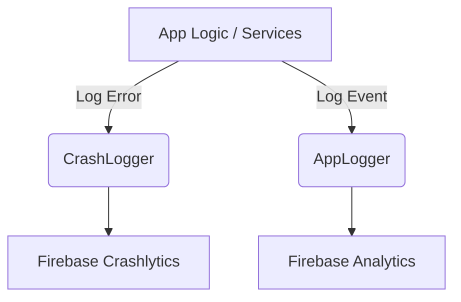

# Documentation: src/services/LoggingService.ts

## 1. Overview & Role
Handles all application analytics (tracking what users click) and crash reporting (logging when things break). It wraps Firebase's native modules to provide a clean, centralized interface for logging.

## 2. Imports & Dependencies
- `Platform` from `react-native`: Ensures we don't try to run native iOS/Android code if the app ever runs on the Web.
- `AsyncStorage` from `@react-native-async-storage/async-storage`: (Currently commented out in code) Intended to check if the user has opted into debug mode.
- `analytics`, `crashlytics` from `@react-native-firebase/*`.

## 3. Data Structures / Interfaces
None.

## 4. Deep-Dive: Methods & Functions

### `AppLogger` Class
Used for non-error tracking.

- **`isDebugEnabled()` (Private)**: Currently hardcoded to return `true`. Previously checked `AsyncStorage`.
- **`info(message, params)`**:
  - **Signature**: `static async info(message: string, params: object = {})`
  - **Step-by-Step Logic**: 
    1. If running locally (`__DEV__`), it prints to the terminal console.
    2. If on a physical device (`Platform.OS !== 'web'`), it checks `AsyncStorage` for `debug_mode`.
    3. Logs a custom event `app_info` to Firebase Analytics.
    4. Also pushes a text breadcrumb to Crashlytics, so if the app crashes a minute later, developers can see exactly what the user was doing beforehand.

### `CrashLogger` Class
Used for error tracking.

- **`setContext(key, value)`**: 
  - Attaches persistent data to future crash reports (like "User ID: 12345").
- **`error(error, context)`**:
  - **Signature**: `static error(error: any, context: string = 'General')`
  - **Purpose**: Gracefully logs caught errors without crashing the app.
  - **Step-by-Step Logic**: Casts the input to an `Error`, console logs it if in dev mode, sets a specific Crashlytics attribute detailing *where* the error happened (`context`), and then records the non-fatal error to Firebase.
- **`testCrash()`**: Intentionally forces the app to immediately terminate. Used only during initial setup to verify Firebase is receiving crash reports.

## 5. Code Examples
```typescript
try {
  await someFlakyApiCall();
} catch (e) {
  // Logs the error securely to the cloud without showing a scary popup to the user
  CrashLogger.error(e, 'myFunctionName'); 
}
```

## 6. Data Flow Diagram

