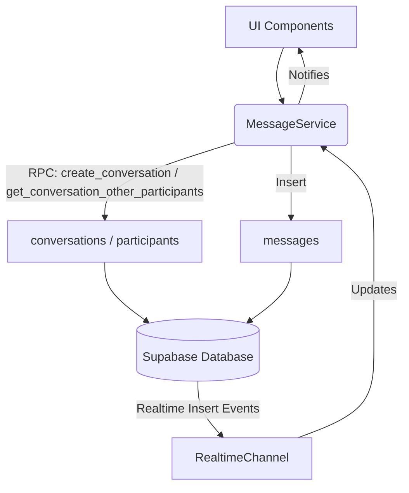

# Documentation: src/services/MessageService.ts

## 1. Overview & Role
Handles direct messaging functionality. It manages creating chat sessions between users, sending messages, and setting up realtime websockets to listen for new chat activity.

## 2. Imports & Dependencies
- `supabase` from `../api/supabase`.
- `Conversation`, `Message`, `UserProfile` models.

## 3. Data Structures / Interfaces
None directly defined in the file.

## 4. Deep-Dive: Methods & Functions

### `getOrCreateConversation(userIdA, userIdB)`
- **Signature**: `async getOrCreateConversation(_userIdA: string, userIdB: string): Promise<string>`
- **Purpose**: Checks if a chat already exists between two users. If it does, returns its ID. If not, creates one and returns the new ID.
- **Step-by-Step Logic**: Calls a Supabase RPC `create_conversation`. The database handles the complex logic of checking `conversation_participants` to find an exact match, ensuring we don't accidentally create duplicate chat rooms. Note that `_userIdA` is unused because the RPC relies on the authenticated user token (auth.uid()).

### `sendMessage(conversationId, senderId, content)`
- **Signature**: `async sendMessage(conversationId: string, senderId: string, content: string): Promise<void>`
- **Step-by-Step Logic**: Inserts a row into `messages`, trimming the text content.

### `listenToConversations(userId, onUpdate, onError)`
- **Signature**: `listenToConversations(...): () => void`
- **Purpose**: Populates the "Inbox" view. Fetches all chats the user is in, the profile of the person they are chatting with, and the most recent message for a preview snippet.
- **Step-by-Step Logic**:
  1. **Fetch Participations**: Finds all `conversation_id`s tied to the `userId`.
  2. **Fetch Metadata**: Gets the creation dates of those conversations.
  3. **Fetch Other Profiles (RPC)**: Calls `get_conversation_other_participants`. This RPC bypasses standard database privacy rules securely, allowing the current user to see the names of people they are in a chat with, even if that person's profile is otherwise private. Groups these profiles by `conversation_id`.
  4. **Fetch Last Message**: Loops through every conversation ID and runs a query `limit(1)` ordered by date descending to get the latest text preview.
  5. **Assemble Data**: Constructs an array of `Conversation` objects and sends it to the UI via `onUpdate`.
  6. **Websocket Hooks**: Subscribes to `INSERT` events on the `messages` table and `conversation_participants` table. If someone sends a new message, or adds you to a chat, it re-runs the entire fetch logic.

### `listenToMessages(conversationId, onUpdate, onError)`
- **Signature**: `listenToMessages(...): () => void`
- **Purpose**: Loads the actual chat history when viewing a specific conversation.
- **Step-by-Step Logic**: Queries the `messages` table filtered by `conversation_id`, ordering oldest to newest (`ascending: true`). Opens a websocket specifically listening to that one conversation room.

## 5. Code Examples
```typescript
// Sending a message
await MessageService.sendMessage(currentChat.id, myUserId, "Hey, what are you getting Mom?");
```

## 6. Data Flow Diagram

