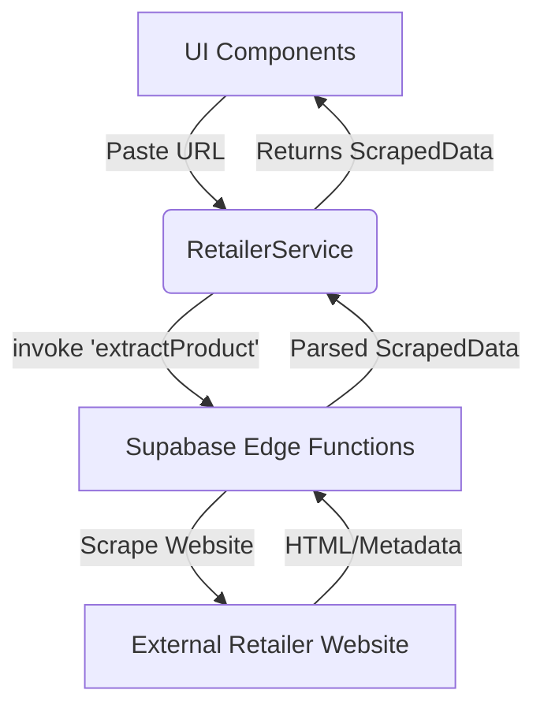

# Documentation: src/services/RetailerService.ts

## 1. Overview & Role
This service allows the app to take a URL pasted by the user (e.g., an Amazon or Target link) and automatically fetch the product's title, price, and image to pre-fill the "Add Gift" form.

## 2. Imports & Dependencies
- `supabase` from `../api/supabase`.
- `CrashLogger` from `./LoggingService`.

## 3. Data Structures / Interfaces
- **`ScrapedData`**: `interface { title?: string; price?: number; image?: string; description?: string; }`. The expected return shape of the web scraper.

## 4. Deep-Dive: Methods & Functions

### `isValidUrl(urlString)`
- **Signature**: `function isValidUrl(urlString: string): boolean`
- **Purpose**: Checks if a string is a properly formatted web link.
- **Step-by-Step Logic**: Attempts to initialize the native Javascript `URL` object inside a `try/catch`. If it succeeds, it's valid. If it crashes, it returns `false`.

### `fetchItemMetadata(url)`
- **Signature**: `async fetchItemMetadata(url: string): Promise<ScrapedData>`
- **Purpose**: Calls a secure backend function to scrape a website. (The app itself does not scrape the website, as mobile devices can be blocked by security measures like Cloudflare. Instead, it asks the Supabase backend to do it).
- **Step-by-Step Logic**:
  1. Validates the URL. Returns an empty object if bad.
  2. Calls `supabase.functions.invoke('extractProduct', { body: { url } })`. This executes a Serverless Edge Function on Supabase.
  3. Checks for an invocation error.
  4. Returns the parsed data, enforcing data types (e.g., ensuring `price` is always a number or 0).
  5. If the edge function crashes or times out, the `catch` block silently logs the error and returns an empty object, allowing the user to type in the details manually without being blocked.

## 5. Code Examples
```typescript
const data = await RetailerService.fetchItemMetadata('https://amazon.com/dp/12345');
console.log(data.title); // "Playstation 5 Console"
```

## 6. Data Flow Diagram

