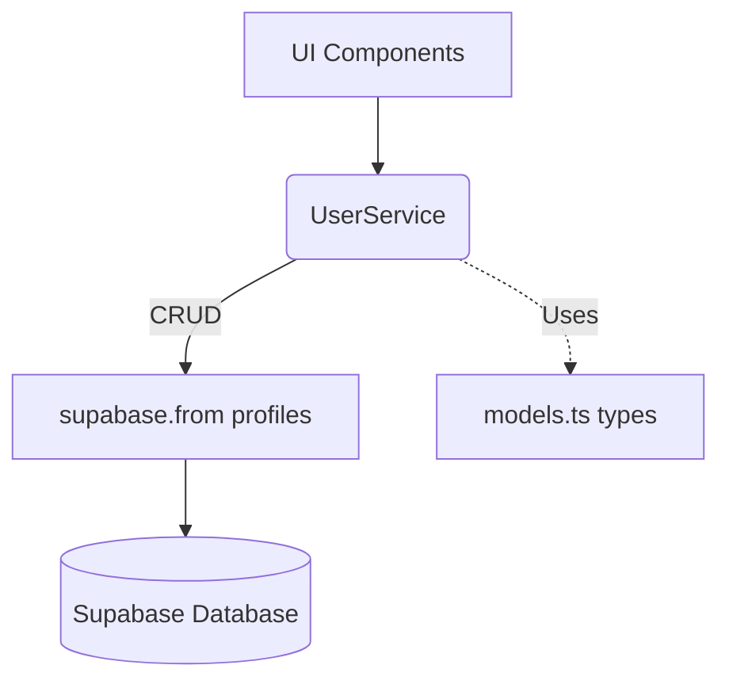

# Documentation: src/services/UserService.ts

## 1. Overview & Role
While `AuthService` handles logging in (credentials), `UserService` manages the user's *profile data* stored in the database. This includes their display name, avatar URL, birthday, and legal/privacy settings.

## 2. Imports & Dependencies
- `supabase` from `../api/supabase`: Used to read/write to the `profiles` table.
- `User`, `UserProfile` from `../types/models`: Ensures data retrieved from Supabase matches the expected shape.

## 3. Data Structures / Interfaces
Relies on `User` and `UserProfile` from `models.ts`.

## 4. Deep-Dive: Methods & Functions

### `createDefaultUser(uid, email)`
- **Signature**: `export function createDefaultUser(uid: string, email: string): User`
- **Purpose**: Generates a skeleton `User` object with default/empty values.
- **Step-by-Step Logic**: Returns a massive object where `displayName`, `photoURL`, etc., are explicitly set to empty strings or `null`.
- **Modification Guide**: If you add a new "favorite color" setting to the app, you must add it here so new users default to a specific color (e.g., `favoriteColor: 'blue'`).

### `createUserProfile(user)`
- **Signature**: `async createUserProfile(user: User): Promise<void>`
- **Purpose**: Saves or updates a full user profile in the database.
- **Step-by-Step Logic**:
  1. Calls `supabase.from('profiles').upsert(...)`. Upsert means "Update if it exists, Insert if it doesn't".
  2. Maps the frontend camelCase properties (like `displayName`) to the database snake_case columns (like `display_name`).
  3. Handles optional fields tightly (e.g., `user.minorProtection?.isMinor ?? false` ensures a strict true/false is sent to the DB, never undefined).
- **Error Handling**: Throws the raw error for the calling function to handle.
- **Modification Guide**: If you add a new field to the DB, add the mapping here inside the `.upsert()` object.

### `getUserProfile(uid)`
- **Signature**: `async getUserProfile(uid: string): Promise<User | null>`
- **Purpose**: Fetches a specific user's full data.
- **Step-by-Step Logic**: Queries the `profiles` table for `id` matching `uid`. Uses `maybeSingle()`. If data is found, it passes the raw database row into `mapRowToUser(data)`.

### `searchUsersByEmail(query)`
- **Signature**: `async searchUsersByEmail(query: string): Promise<UserProfile[]>`
- **Purpose**: Allows users to find friends by typing part of an email.
- **Step-by-Step Logic**:
  1. Queries the `profiles` table, but ONLY selects public fields (`id, email, display_name...`). It explicitly ignores private fields like GDPR data.
  2. Uses `.ilike('email', '%${query}%')` to perform a case-insensitive, partial-match search.
  3. Limits the result to 10 rows to prevent massive data fetching.

### `getUserProfiles(uids)`
- **Signature**: `async getUserProfiles(uids: string[]): Promise<UserProfile[]>`
- **Purpose**: Fetches public profiles for an array of User IDs (e.g., fetching data for a list of friends).
- **Step-by-Step Logic**: Uses `.in('id', uids)` to fetch all requested profiles in a single network request.

### `mapRowToUser(row)` / `mapRowToProfile(row)` (Internal Helpers)
- **Purpose**: Translates snake_case database columns into camelCase frontend TypeScript objects. This keeps the rest of the app totally ignorant of how the database names its columns.

## 5. Code Examples
```typescript
// Updating a display name
const user = createDefaultUser('123', 'test@test.com');
user.displayName = 'Johnny';
await UserService.createUserProfile(user); // Saves to Supabase
```

## 6. Data Flow Diagram

