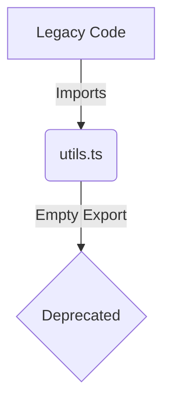

# Documentation: src/services/utils.ts

## 1. Overview & Role
This file is deprecated. It previously held utility functions for handling specific Firestore timestamp objects. Because the application was fully migrated from Firestore to Supabase (PostgreSQL), all dates and timestamps are now handled as standard ISO strings across the codebase (e.g., `'2026-12-25T10:00:00Z'`).

## 2. Imports & Dependencies
None.

## 3. Data Structures / Interfaces
None.

## 4. Deep-Dive: Methods & Functions
None. The file only contains an `export {}` statement.
- **Step-by-Step Logic**: `export {}` marks the file as a module to prevent TypeScript errors in files that might still be importing from it as a placeholder.
- **Modification Guide**: It is safe to delete this file entirely once you verify no other components are importing from `src/services/utils`.

## 5. Code Examples
```typescript
// No code examples apply.
```

## 6. Data Flow Diagram

