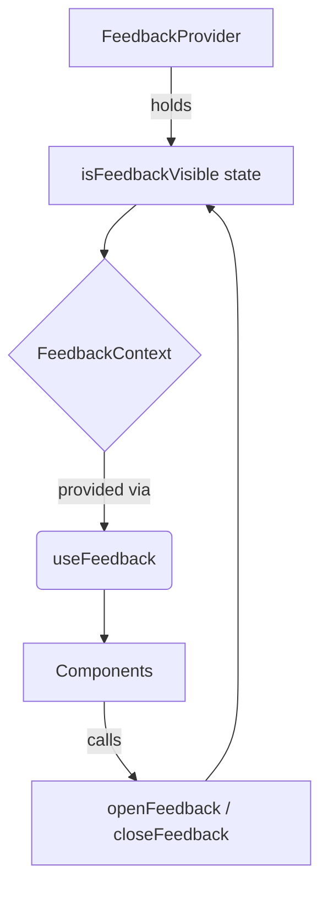

# `src/theme/FeedbackContext.tsx`

## 1. Overview & Role
This context manages the visibility state of a global feedback or "toast" mechanism (e.g., a "Saved successfully" popup). By centralizing this state in a Context, any component in the app, no matter how deeply nested, can trigger the feedback popup to appear on screen.

## 2. Imports & Dependencies
- `React`, `createContext`, `useContext`, `useState`: Standard React hooks and context utilities.

## 3. Data Structures / Interfaces

### `FeedbackContextType`
- `openFeedback`: `() => void` - Function to trigger the feedback display.
- `closeFeedback`: `() => void` - Function to hide the feedback display.
- `isFeedbackVisible`: `boolean` - The current visibility state.

## 4. Deep-Dive: Methods & Functions

### `FeedbackProvider`
- **Signature**: `export const FeedbackProvider = ({ children }: { children: React.ReactNode })`
- **Purpose**: Wraps the application to hold the source of truth for whether the feedback UI should be showing.
- **Step-by-Step Logic**:
  1. Initializes `isFeedbackVisible` state to `false`.
  2. Defines `openFeedback` which simply calls `setIsFeedbackVisible(true)`.
  3. Defines `closeFeedback` which simply calls `setIsFeedbackVisible(false)`.
  4. Provides these values through `FeedbackContext.Provider`.
- **Error Handling**: N/A.
- **Modification Guide**: If you want the feedback context to hold a custom message rather than just a boolean, you would change the state to `useState({ visible: false, message: '' })`, update the interface, and modify `openFeedback(message: string)` to set both values.

### `useFeedback`
- **Signature**: `export const useFeedback = () => FeedbackContextType`
- **Purpose**: Custom hook to consume the FeedbackContext.
- **Step-by-Step Logic**:
  1. Calls `useContext(FeedbackContext)`.
  2. Checks if `context` is undefined.
  3. If undefined, throws a hard error indicating the hook must be used inside a `FeedbackProvider`.
  4. Returns the context.
- **Error Handling**: Throws an error to prevent silent failures if a developer forgets to wrap the app in the provider.
- **Modification Guide**: No changes needed unless the context name changes.

## 5. Code Examples
```tsx
import { useFeedback } from '../theme/FeedbackContext';

const SaveButton = () => {
  const { openFeedback } = useFeedback();

  const handleSave = async () => {
    await saveToDatabase();
    // Trigger global success popup
    openFeedback();
  };

  return <Button title="Save" onPress={handleSave} />;
};
```

## 6. Data Flow Diagram

