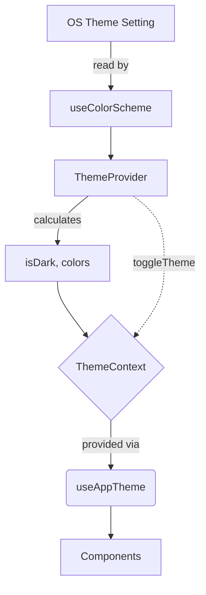

# `src/theme/ThemeContext.tsx`

## 1. Overview & Role
This file handles the global theming configuration for the app. It provides colors for light and dark modes, and automatically toggles between them by listening to the mobile operating system's system-level theme preferences. Components can consume this context to ensure they are using standard, unified colors.

## 2. Imports & Dependencies
- `React`, `createContext`, `useContext`, `useState`, `useEffect`: Standard React tools for Context and state management.
- `useColorScheme`: Hook from `react-native` that checks whether the user's phone is currently set to dark mode or light mode globally.

## 3. Data Structures / Interfaces

### `ThemeColors`
A precise dictionary of color roles used throughout the app.
- `background`: Main app backdrop.
- `card`: Background for layered elements like cards or modals.
- `text`: Primary readable text.
- `textDim`: Secondary, less prominent text (like subtitles).
- `primary`: The main brand/action color (e.g., a blue button).
- `danger`: Color used for destructive actions like delete.
- `border`: Color for thin divider lines.

### `lightColors` & `darkColors`
Two constant objects adhering to `ThemeColors` containing specific hex codes (e.g., `#FFFFFF`, `#000000`, `#007AFF`).

### `ThemeContextProps`
- `isDark`: boolean representing if dark mode is active.
- `colors`: The current active `ThemeColors` object.
- `toggleTheme`: A manual override function.

## 4. Deep-Dive: Methods & Functions

### `ThemeProvider`
- **Signature**: `export const ThemeProvider: React.FC<{ children: React.ReactNode }>`
- **Purpose**: Wraps the root app component to inject theming properties downward.
- **Step-by-Step Logic**:
  1. Calls `useColorScheme()` to get the OS-level preference.
  2. Initializes `isDark` state, defaulting to true if the OS is in 'dark' mode.
  3. Sets up a `useEffect` that listens for changes to `systemColorScheme`. If the user changes their phone settings while the app is open, `isDark` updates instantly.
  4. Defines `toggleTheme`, which flips the `isDark` boolean.
  5. Determines `colors` dynamically: if `isDark` is true, use `darkColors`, otherwise `lightColors`.
  6. Renders `ThemeContext.Provider` passing down the values.
- **Error Handling**: N/A, very safe operations.
- **Modification Guide**: To add a new color, e.g., "success" for green checkmarks, you must add `success: string` to the `ThemeColors` interface, then add a green hex code to both `lightColors` and `darkColors`.

### `useAppTheme`
- **Signature**: `export const useAppTheme = () => useContext(ThemeContext)`
- **Purpose**: Custom hook enabling any child component to read the current colors.
- **Step-by-Step Logic**:
  1. Returns `useContext(ThemeContext)`.
- **Error Handling**: Does not throw an error if used outside a provider, but will default to the initial context values (light mode).
- **Modification Guide**: Safe to use as-is.

## 5. Code Examples
```tsx
import { useAppTheme } from '../theme/ThemeContext';

const MyButton = () => {
  const { colors, isDark } = useAppTheme();

  return (
    <View style={{ backgroundColor: colors.background, borderColor: colors.border }}>
      <Text style={{ color: colors.primary }}>
        {isDark ? 'Dark Mode Active' : 'Light Mode Active'}
      </Text>
    </View>
  );
};
```

## 6. Data Flow Diagram

