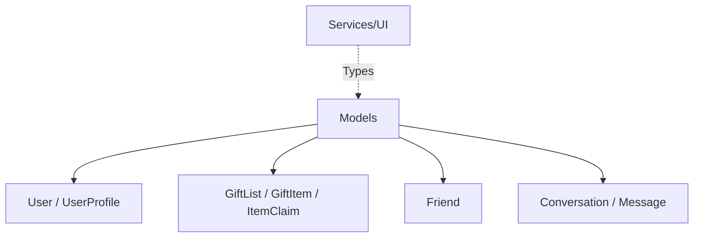

# Documentation: src/types/models.ts

## 1. Overview & Role
This file is the central source of truth for all data models (TypeScript interfaces) used across the application. By defining these interfaces here, we ensure that every file handling a `User`, `GiftList`, or `Message` expects the exact same properties. This prevents bugs like trying to read a property that doesn't exist.

## 2. Imports & Dependencies
There are no imports in this file. It only exports TypeScript types and interfaces.

## 3. Data Structures / Interfaces (Deep-Dive)

### `User`
Defines the core user account data.
- **Properties**:
  - `uid`: A string representing the unique user ID (from Supabase Auth).
  - `email`: The user's email address.
  - `displayName`: The combined name shown in the UI.
  - `photoURL`: A link to their profile picture (or null).
  - `minorProtection`: Nested object storing boolean `isMinor` and `parentEmail` for child safety logic.
  - `legalAcceptance`: Nested object tracking GDPR and terms of service acceptance status.

### `GiftList`
Defines a registry or wishlist created by a user.
- **Properties**:
  - `id`: The unique list ID.
  - `ownerId`: The UID of the user who created it.
  - `title`: The name of the list (e.g., "Christmas 2026").
  - `isPrivate`: Boolean indicating if the list is completely private.
  - `shareCode`: A 7-character string used to join the list if it is shared.

### `GiftItem` & `GiftItemUI`
Defines a specific gift within a `GiftList`.
- **Properties**:
  - `id`: Unique item ID.
  - `listId`: The ID of the parent list.
  - `price`: Optional numeric value for the cost.
  - `url`: Optional web link to buy the item.
  - `substitutions`: Boolean indicating if the receiver accepts alternative brands/colors.
- **`GiftItemUI`**: Extends `GiftItem` by adding a `claimStatus` property. This is used by the frontend to combine the raw item data with its current claim status.

### `ItemClaim`
Tracks who has promised to buy a specific gift.
- **Properties**:
  - `itemId`: The specific gift being claimed.
  - `claimedBy`: The UID of the user claiming the gift.
  - `listOwnerId`: The UID of the person receiving the gift (used for permissions/RLS).

### `Friend` & `UserProfile`
Tracks relationships between users.
- **Properties**:
  - `status`: Uses the literal type `FriendStatus` ('pending' | 'accepted' | 'declined').
  - `profile`: An optional `UserProfile` object containing basic public information (like `displayName` and `photoURL`) of the friend.

### `Conversation` & `Message`
Defines the messaging functionality for friends or list collaborators.
- **`Conversation`**: Contains an array of `participants` (UserProfiles) and optionally the `lastMessage` for previewing in a list.
- **`Message`**: Contains the raw text `content`, `senderId`, and the timestamp `createdAt`.

## 4. Deep-Dive: Methods & Functions
None. This file only contains types, no executable logic.

## 5. Code Examples
```typescript
import { GiftList } from '../types/models';

function displayListInfo(list: GiftList) {
  console.log(list.title); // TypeScript knows 'title' exists
  // console.log(list.color); // TypeScript throws an error because 'color' is not in the interface
}
```

## 6. Data Flow Diagram

